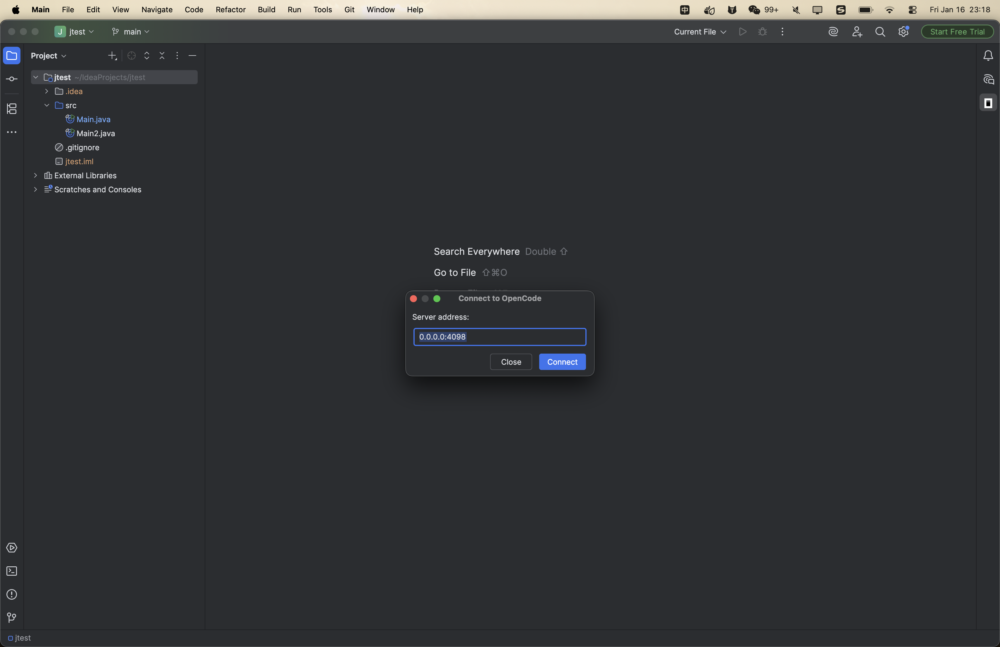
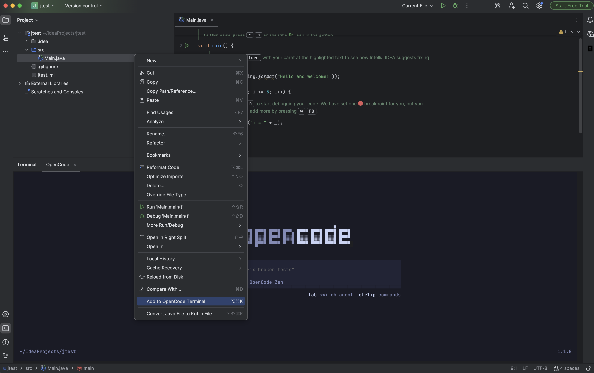
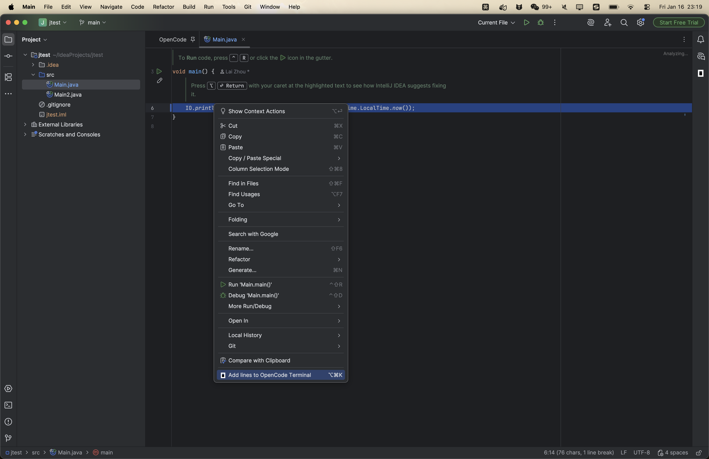
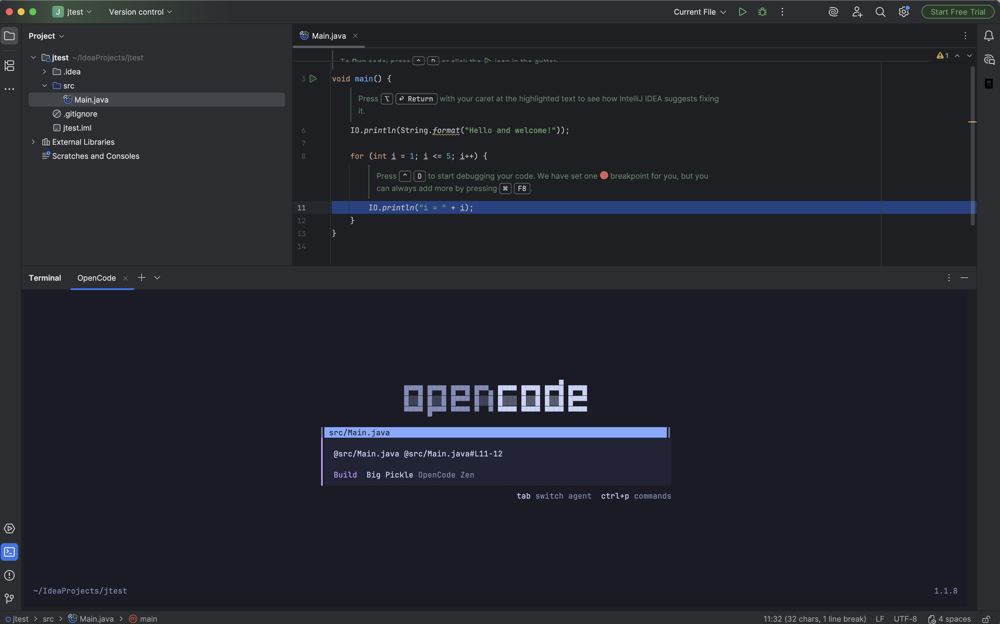
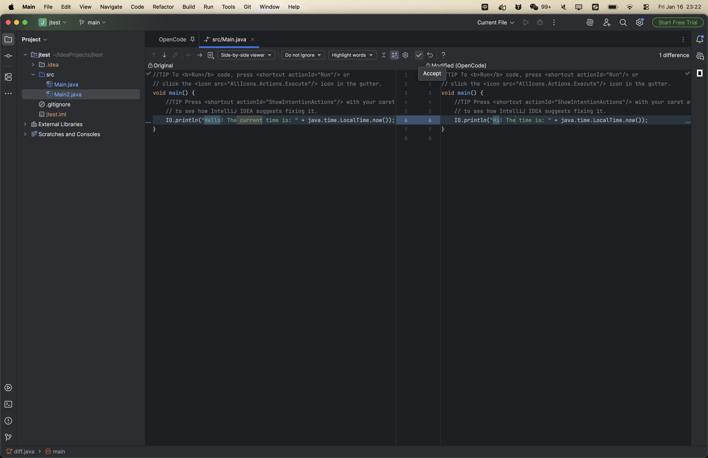
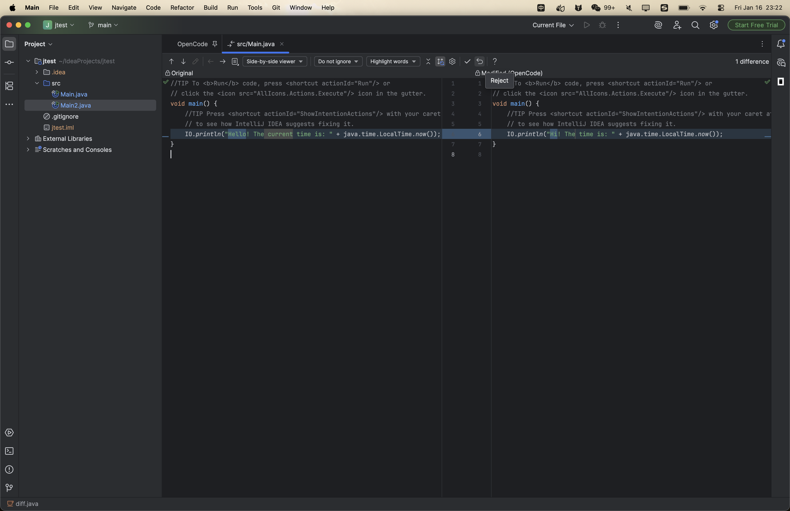

# OpenCode JetBrains Plugin

[](https://plugins.jetbrains.com)
[](https://opencode.ai)

A JetBrains IDE plugin that integrates [OpenCode](https://opencode.ai) — the open-source AI coding agent — directly into your development workflow.

**Author**: hhlai1990@gmail.com

## Features

| Feature | Description | Shortcut (Mac) | Shortcut (Win/Linux) |
|---------|-------------|----------------|----------------------|
| **Quick Launch** | Open or focus the OpenCode terminal | `Cmd + Esc` | `Ctrl + Esc` |
| **Add to Terminal** | Send current file/selection or selected files to OpenCode | `Opt + Cmd + K` | `Ctrl + Alt + K` |
| **Diff Review** | View diffs and accept/reject changes in IDE | — | — |

### Feature Comparison with Claude Code

| Feature | Claude Code | OpenCode |
|---------|-------------|----------|
| Quick Launch | ✅ | ✅ |
| Diff Viewing | ✅ | ✅ |
| File Reference Shortcuts | ✅ | ✅ |
| LocalHistory Protection | ❌ | ✅ |
| Diagnostic Sharing | ✅ | ❌ (uses built-in LSP) |

### Sidebar Icon

Click the **OpenCode** icon in the right sidebar to instantly focus or create an OpenCode terminal session.

### Context Menus

- **Editor**: Right-click in editor → *OpenCode: Add Context*
- **Project View**: Right-click on files/folders → *OpenCode: Add File(s)*

## Requirements

- **JetBrains IDE**: IntelliJ IDEA, WebStorm, PyCharm, etc. (2025.2+)
- **OpenCode CLI**: Install via `npm install -g opencode` or see [opencode.ai/download](https://opencode.ai/download)

## Installation

### From JetBrains Marketplace (Recommended)

1. Open **Settings** → **Plugins** → **Marketplace**
2. Search for "OpenCode"
3. Click **Install**

### Manual Installation

1. Download the plugin ZIP from [Releases](https://github.com/anomalyco/opencode/releases)
2. Open **Settings** → **Plugins** → ⚙️ → **Install Plugin from Disk...**
3. Select the downloaded ZIP file

## Usage

### 1. Launch OpenCode Terminal

Press `Cmd+Esc` (Mac) or `Ctrl+Esc` (Win/Linux) to open the OpenCode terminal. If no OpenCode session exists, a new terminal tab named "OpenCode" will be created and the `opencode` command will be executed automatically.



### 2. Send Code Context to OpenCode

In the editor or Project View, press `Opt+Cmd+K` (Mac) or `Ctrl+Alt+K` (Win/Linux).

- If the OpenCode terminal is not open yet, the plugin creates/focuses it automatically.
- In the editor, it shares the **current file** even if nothing is selected.



The plugin will send:

- **Editor selection**: `@path/to/file.kt#L10-25`
- **Editor (no selection)**: `@path/to/file.kt`
- **Project View selection**: `@path/to/file.kt` for each selected file



This allows OpenCode to understand the context of your question or request.

### 3. Sidebar Button

Click the OpenCode icon in the right sidebar to quickly focus or create the OpenCode terminal.



### 4. Review Diffs

When OpenCode edits files, the plugin opens a native IDE diff viewer.

- **Chronological View**: Automatically shows changes in the order they were made by OpenCode (replay thought process), starting from the first modified file.
- **Navigation**: Use **← →** arrows to switch files and **↑ ↓** arrows to jump between changes in a file.
- **Trigger**: The diff viewer opens automatically when OpenCode finishes a response (session idle).
- **Accept**: Stages the changes locally (`git add`), marking them as reviewed.
- **Reject**: Restores file to its pre-OpenCode state using `diff.before` content. This preserves your unstaged changes and staging state. LocalHistory protection ensures you can always recover.
- **Auto-advance**: After accepting/rejecting, the plugin automatically opens the next pending diff.




## Keyboard Shortcuts

All shortcuts are customizable via **Settings** → **Keymap** → search for "OpenCode".

| Action | Mac | Windows/Linux |
|--------|-----|---------------|
| Open/Focus OpenCode | `Cmd + Esc` | `Ctrl + Esc` |
| Add to OpenCode Terminal | `Opt + Cmd + K` | `Ctrl + Alt + K` |

## Terminal Management

The plugin uses a single terminal tab per project named **"OpenCode"**.

- Only one OpenCode terminal session per project
- The terminal persists across plugin actions
- Closing the terminal tab will create a new one on next launch

## Troubleshooting

### "opencode: command not found"

Install the OpenCode CLI:

```bash
npm install -g opencode
```

Or download from [opencode.ai/download](https://opencode.ai/download)

### Terminal not responding

Try closing the "OpenCode" terminal tab and pressing `Cmd+Esc` again to create a fresh session.

### Shortcuts not working

1. Check for conflicts in **Settings** → **Keymap**
2. Search for your shortcut to see if it's assigned to another action
3. Reassign or remove conflicting shortcuts

## Support

- [OpenCode Documentation](https://opencode.ai/docs)
- [GitHub Issues](https://github.com/anomalyco/opencode/issues)
- [Discord Community](https://opencode.ai/discord)

## License

MIT License. See [LICENSE](LICENSE) for details.
