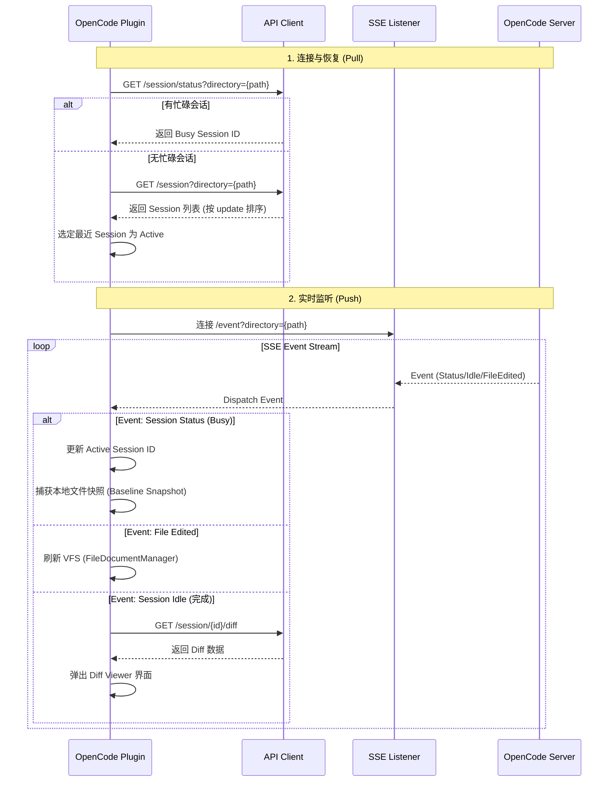

# base_feature.plan.md - OpenCode JetBrains Plugin

**Author**: hhlai1990@gmail.com

## 概述

这是一个 JetBrains IDE 插件，用于将 [OpenCode](https://opencode.ai)（开源 AI coding agent）集成到 IDE 工作流中。

本文档描述“基础能力”的最终用户体验与实现要点（以 Claude Code JetBrains 插件的交互习惯为对齐目标）。

## 已实现功能

### 1) Quick Launch（快速打开/聚焦终端）

| 平台 | 快捷键 |
|------|--------|
| Mac | `Cmd + Esc` |
| Windows/Linux | `Ctrl + Esc` |

**行为：**
- 显示连接对话框，允许用户输入自定义 `host:port`（默认 `127.0.0.1:4096`）
- **连接到已有 server**：检测并连接到 OpenCode Desktop 或其他已运行的 OpenCode server（支持自动 HTTP Basic Authentication）
- **创建新 terminal**：若 hostname 为 localhost 且端口为默认值，则在 **Editor 区域**创建 `OpenCode` terminal tab 并启动本地 server（占用更大空间，便于 TUI 显示）
- IDE 启动时不会自动创建终端，只有用户显式触发才会启动

### 2) Add Context to Terminal（添加上下文到终端）

| 平台 | 快捷键 |
|------|--------|
| Mac | `Opt + Cmd + K` |
| Windows/Linux | `Ctrl + Alt + K` |

**行为：**
- **Editor（有选区）**：发送 `@path#Lstart-end`（仅引用，不发送源码内容）
- **Editor（无选区）**：发送 `@path`（当前文件引用）
- **Project View（多选文件/目录）**：为每个条目发送 `@path`
- 若 OpenCode 终端未打开：插件会自动创建/聚焦终端，然后再插入引用（避免“无终端就没反应”的困惑）

### 3) Sidebar Icon（右侧栏图标）

- 右侧栏仅保留一个 OpenCode 图标
- 点击图标触发 Quick Launch 行为（聚焦/创建终端）
- ToolWindow 本身不展示复杂内容：触发后立即隐藏（对齐 Claude 的“点击即跳转”风格）

## 技术实现

### 架构（核心对象）

```
OpenCodeService (Project-scoped)
├── focusOrCreateTerminal()            # 显示连接对话框，连接或创建终端
├── connectToExistingServer()          # 连接到已有 OpenCode server（支持自动认证）
├── createTerminalAndConnect()         # 在 Editor 区域创建 terminal tab 并启动 server
├── pasteToTerminal()                  # 粘贴到已存在终端
└── focusOrCreateTerminalAndPaste()    # 统一 UX：可自动创建并重试粘贴

OpenCodeTerminalVirtualFile            # 虚拟文件，代表 Editor 中的 terminal tab
OpenCodeTerminalFileEditor             # FileEditor 实现，包装 terminal widget
OpenCodeTerminalFileEditorProvider     # FileEditorProvider，管理 terminal editor 创建

OpenCodeConnectDialog                  # 连接对话框（输入 host:port）
ProcessAuthDetector                    # 自动检测 OpenCode Desktop 认证信息
OpenCodeApiClient                      # HTTP API 客户端（支持 Basic Auth）
SseEventListener                       # SSE 事件监听（支持 Basic Auth）
PortFinder                             # 端口检测和健康检查（支持 Basic Auth）

OpenCodeToolWindowFactory              # 右侧栏图标行为
QuickLaunchAction                      # Cmd+Esc handler
SendSelectionToTerminalAction          # Opt+Cmd+K handler

```

### Session & API Client 监听机制

**核心机制：Active Pull (恢复) + Real-time Push (SSE)**

监听器绑定到**项目路径**，而非单一 Session。这意味着只要是同一个 Server 对该项目的操作，IDE 都能感知并自动切换焦点。



**关键策略：**

1.  **项目级锁定**：监听基于物理路径，覆盖该路径下所有并发 Session。
2.  **活跃抢占 (Active Preemption)**：任何 Session 变更为 `busy` 状态即成为 `activeSessionId`，确保 Diff Viewer 始终展示当前正在工作的 AI 上下文。
3.  **基准快照 (Baseline Snapshot)**：在 `busy` 瞬间捕获本地文件状态，作为 `Reject` 操作的“真理来源”，解决服务端 `before` 内容可能不准的问题。

### 关键 API

- `TerminalView.createLocalShellWidget()` - 创建 Terminal widget
- `ShellTerminalWidget.executeCommand()` - 执行命令
- `TtyConnector.write()` - 向终端注入文本
- `FileEditorManager` - 管理 Editor 区域的文件/tab
- `FileEditorProvider` - 自定义 Editor 类型（用于 terminal tab）
- `FileEditorManagerListener` - 监听 Editor tab 关闭事件
- `Alarm` - 防抖/调度（避免自建线程池）

### plugin.xml（关键注册点）

- Actions:
  - `OpenCode.QuickLaunch`（Tools 菜单 + 快捷键）
  - `OpenCode.AddLines`（EditorPopupMenu）
  - `OpenCode.AddFile`（ProjectViewPopupMenu）
- Extensions:
  - `toolWindow` id=`OpenCode`
  - `projectService`：`OpenCodeService` / `SessionManager` / `DiffViewerService`

## 项目结构（关键路径）

```
src/main/kotlin/ai/opencode/ide/jetbrains/
├── OpenCodeService.kt
├── OpenCodeToolWindow.kt
├── QuickLaunchAction.kt
├── SendSelectionToTerminalAction.kt
├── diff/
├── session/
├── terminal/
│   ├── OpenCodeTerminalVirtualFile.kt
│   ├── OpenCodeTerminalFileEditor.kt
│   └── OpenCodeTerminalFileEditorProvider.kt
└── util/

src/main/resources/META-INF/plugin.xml
```

## 验证用例

1. 按 `Cmd+Esc` / `Ctrl+Esc`：在 Editor 区域创建或聚焦 `OpenCode` 终端 tab
2. Editor 无选区按 `Opt+Cmd+K`：插入 `@current-file`
3. Editor 有选区按 `Opt+Cmd+K`：插入 `@current-file#Lx-y`
4. Project View 选中多个文件/目录按 `Opt+Cmd+K`：插入多个 `@path`
5. 点击右侧栏 OpenCode 图标：在 Editor 区域聚焦/创建终端
6. 关闭 OpenCode terminal tab：自动清理连接状态
