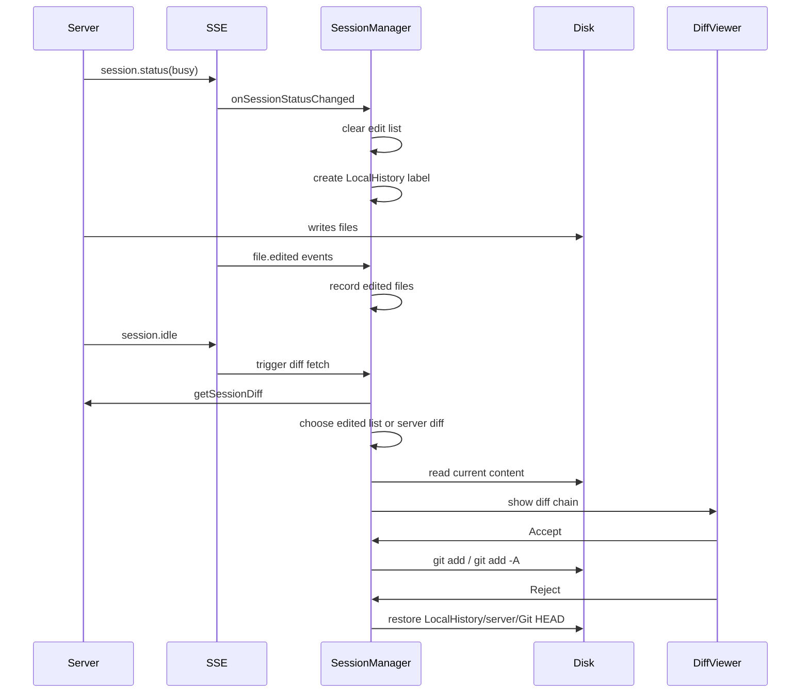

# OpenCode JetBrains Diff Feature Plan

## Overview

This document describes the diff workflow for the OpenCode JetBrains plugin. The design aligns with Claude Code: use the working tree as the source of truth, rely on explicit `file.edited` events to scope OpenCode changes, and use LocalHistory for safe rollback.

---

## Core Architecture & Data Flow

The plugin prioritizes **local Git operations** rather than server-side revert APIs. This keeps the plugin resilient in stateless mode and leverages JetBrains VCS integration.

### Architecture Diagram

```mermaid
graph TD
    subgraph IDE [JetBrains IDE]
        direction TB

        subgraph Services [Project Services]
            OCS[OpenCodeService]
            SM[SessionManager]
            DVS[DiffViewerService]
        end

        subgraph UI [User Interface]
            Term[Terminal Tab]
            DiffView[Diff Viewer]
        end

        subgraph Data [Local State]
            EditList[OpenCode Edited Files]
            LocalHist[Local History Label]
            VFS[Virtual File System]
        end
    end

    subgraph Server [OpenCode Server]
        API[API Endpoints]
        SSE[SSE Stream]
    end

    Term -->|Start Process| Server
    Server -->|Events| SSE
    SSE -->|Session Status| OCS
    OCS -->|Delegate| SM

    SM -->|Create baseline label| LocalHist
    SM -->|Track OpenCode edits| EditList
    SM -->|Fetch diffs (fallback)| API
    API -->|Diff data| SM
    SM -->|Show diffs| DVS
    DVS -->|Render| DiffView

    DiffView -->|Accept| SM
    DiffView -->|Reject| SM

    SM -->|git add| VFS
    SM -->|Restore content| VFS
    SM -->|Create label| LocalHist
```

### Diff Flow Diagram



---

## Key Flows

### 1. Diff Collection & Display

- **Trigger**: SSE `session.status` (`busy` → `idle`) and `session.idle`.
- **Busy Start**:
  - Clear the OpenCode edit list.
  - Create LocalHistory label `OpenCode Modified Before`.
- **Edit Tracking**:
  - On `file.edited`, record the file path in the OpenCode edit list and refresh VFS.
- **Idle**:
  - Fetch session diffs from the server (metadata only).
  - Build the display list:
    - If OpenCode edit list is **non-empty**, use it as the file set.
    - If the edit list is empty, skip diff display and notify once per busy cycle.
    - If a file appears in the edit list but not in the server diff, build the entry from disk content only.
    - Resolve **before** from LocalHistory, then server `before`, then Git HEAD, else empty string.
    - Resolve **after** from current disk content; if disk is unavailable, fall back to server `after`.
    - Skip entries where `before == after`.
- **Display**: Use DiffManager multi-file chain, no implicit accept or duplicate suppression.

### 2. Accept (Stage Changes)

- **Operation**: `git add <file>` or `git add -A <file>` if deleted.
- **Behavior**: stages the current disk content; no overwrite prompts or disk rewrites.

### 3. Reject (Restore Changes)

- **Operation**: restore to `before` content.
- **Data source**: LocalHistory baseline → server `before` → Git HEAD.
- **Deletion**: if `before` is empty and the file is untracked, delete the file via VFS.

---

## Strategy Matrix

| Scenario | File State | OpenCode Action | "Before" Source | Accept Behavior | Reject Behavior |
|----------|------------|-----------------|------------------|-----------------|-----------------|
| **A** | Missing | Create new file | Empty | `git add` | Delete file |
| **B** | Untracked (dirty) | Modify content | LocalHistory | `git add` | Restore LocalHistory |
| **C** | Tracked (clean) | Modify content | LocalHistory / Git HEAD | `git add` | Restore LocalHistory |
| **D** | Tracked (dirty) | Modify content | LocalHistory | `git add` | Restore LocalHistory |

---

## LocalHistory Safety Net

LocalHistory is the rollback backbone. Labels are created at key points:

| Trigger | Label | Purpose |
|--------|-------|---------|
| Session start | `OpenCode Modified Before` | Capture baseline before OpenCode edits |
| Session end | `OpenCode Modified After` | Capture final state after edits |
| Reject action | `OpenCode Rejected <file>` | Allow recovery after reject |

---

## Known Issues & Mitigations

- **Missing `file.edited` events**: diff display is skipped and a notification is shown once per busy cycle.
- **Server Chinese filename encoding**: handled by `FileDiffDeserializer`; the `after` content is read from disk, reducing reliance on server payloads.
- **LocalHistory lookup failure**: fallback order is server `before` → Git HEAD → empty string.
