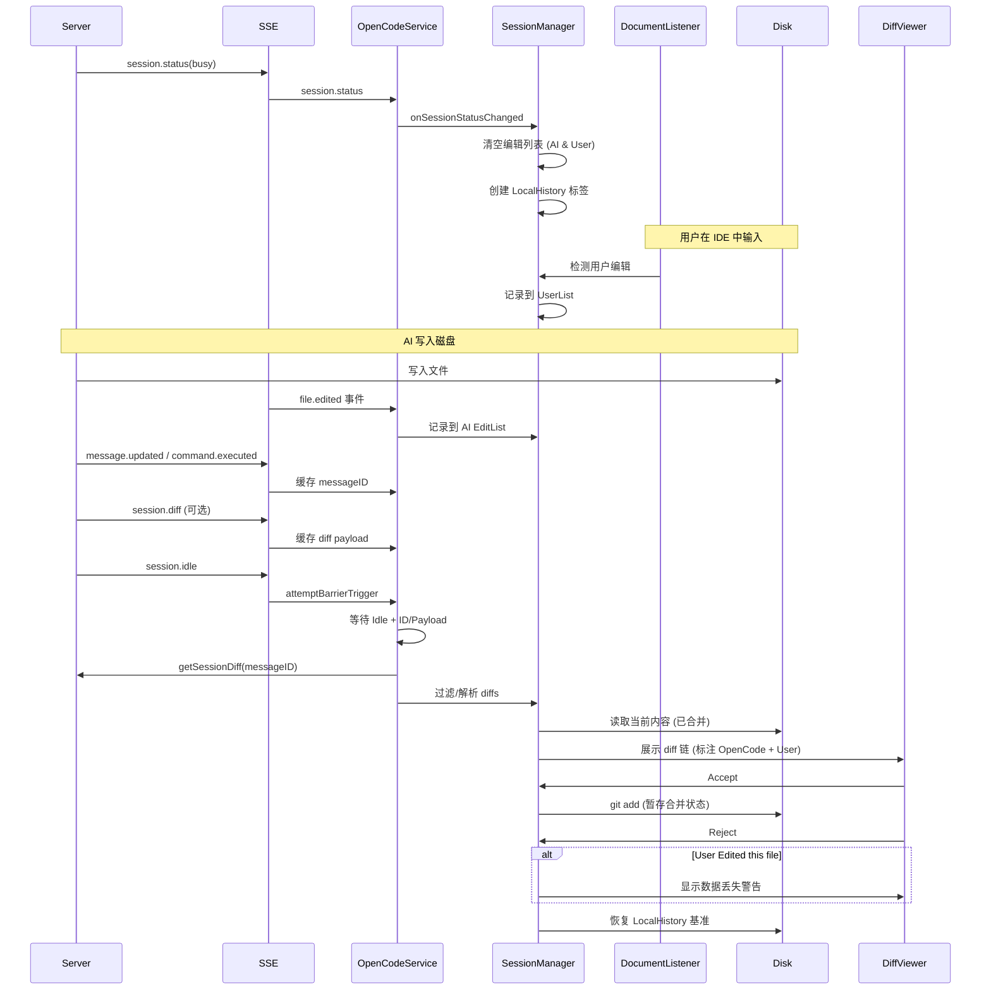

# OpenCode JetBrains 差异对比功能设计

## 概述

本文档描述了 OpenCode JetBrains 插件的 diff 工作流。设计理念与 Claude Code 一致：以工作区（Working Tree）为事实来源，依赖显式的 `file.edited` 事件和 `DocumentListener` 来归因变更，并使用 LocalHistory 进行安全回滚。

---

## 核心架构与数据流

插件优先使用 **本地 Git 操作** 而非服务器端的 revert API。这保持了插件在无状态模式下的弹性，并利用了 JetBrains 的 VCS 集成。

### Diff 流程图

---

## 关键流程

### 1. Diff 收集与展示

- **触发器**: SSE `session.status` (`busy` → `idle`) 和 `session.idle`。
- **Busy 开始**:
  - **幂等转换**: 仅当会话从非 Busy 状态变为 `Busy` 时，才清空基于轮次（Turn-based）的状态（编辑列表、messageID 等）。
  - 创建 LocalHistory 基准标签 `OpenCode Modified Before`。
- **编辑追踪**:
  - **AI 编辑**: 通过 `file.edited` 事件捕获。
  - **用户编辑**: 通过 `DocumentListener` 追踪。
- **Idle 阶段**:
  - **严格栅栏机制 (Strict Barrier)**: 仅当 `Idle` 信号 **且** (`MessageID` **或** `SessionDiff` Payload) 同时存在时，才触发 Diff 拉取。
  - **Fetch 优先级**: 
    1. 精确的 `GET /session/:id/diff?messageID=` (严格模式: 信任 API 结果优先于 SSE payload)。
    2. 缓存的 SSE Payload (仅当 ID 缺失或 Fetch 失败时作为兜底)。
    3. Session Summary (最后的手段)。
  - 构建展示列表:
    - **过滤**: 仅展示 AI 编辑列表中的文件。
    - **差异检查 (Discrepancy Check)**: 如果没有编辑事件，检查磁盘内容是否偏离了基准 **且** 偏离了 Server 期望的 `after` 状态（忽略陈旧残留）。

- **展示**: 使用 DiffManager 多文件链展示。

### 2. Accept (暂存变更)

- **操作**: `git add <file>` 或 `git add -A <file>`。
- **行为**: 暂存当前磁盘内容（包含 AI 生成期间用户的任何微调）。

### 3. Reject (恢复变更)

- **操作**: 恢复到 `before` 状态（LocalHistory 基准）。
- **安全性**:
  - 如果文件包含用户编辑，在继续前显示警告对话框。
  - 恢复后，创建 LocalHistory 标签 `OpenCode Rejected <file>`。

---

## 策略矩阵

| 场景 | 文件状态 | OpenCode 动作 | 用户动作 | Diff 标签 | Reject 行为 |
|----------|------------|-----------------|-------------|------------|-----------------|
| **A** | 已修改 | Edited | 无 | Normal | 恢复基准 |
| **B** | 已修改 | Edited | Edited | Modified (OpenCode + User) | **警告** -> 恢复 |
| **C** | 已修改 | 无 | Edited | *不展示* | N/A |
| **D** | 新文件 | Created | Edited | Modified (OpenCode + User) | **警告** -> 删除 |

---

## 已知问题与缓解措施

- **缺少 `file.edited` 事件**: Diff 展示被跳过，以防止用户独有的编辑被错误归因于 AI。
- **缺少 `messageID`**: Diff 拉取被跳过，除非有缓存的 `session.diff` payload 可用（避免陈旧的历史 diff）。
- **Server 中文文件名编码**: 由 `FileDiffDeserializer` 处理；`after` 内容直接从磁盘读取，绕过 Server payload 的潜在 bug。
- **LocalHistory 查找失败**: 回退顺序为 Server `before` → Git HEAD → 空字符串。

---

## 未来路线图

### 1. 细粒度（片段级）归因
- **现状**: 归因是文件级的。
- **目标**: 使用并排或三路 diff 来区分哪些行是由 AI 修改的，哪些是由用户修改的。
- **要求**: 可靠的 Server 端 `after` 内容或内部偏移量追踪。
