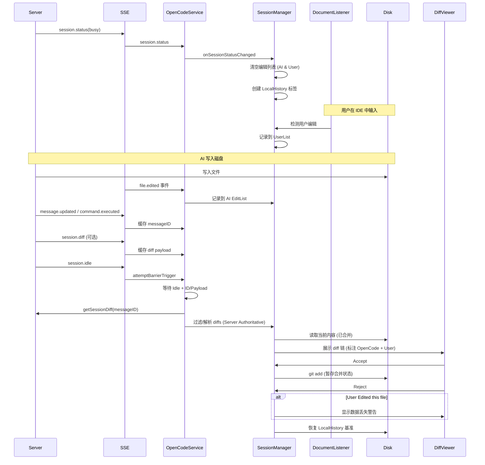

# OpenCode JetBrains 差异对比功能设计

## 概述

本文档描述了 OpenCode JetBrains 插件的 diff 工作流。设计理念与 Claude Code 一致：以工作区（Working Tree）为事实来源，依赖显式的 `file.edited` 事件和 `DocumentListener` 来归因变更，并使用 LocalHistory 进行安全回滚。

---

## 核心架构与数据流

插件优先使用 **本地 Git 操作** 而非服务器端的 revert API。这保持了插件在无状态模式下的弹性，并利用了 JetBrains 的 VCS 集成。

### Diff 流程图



---

## 关键流程

### 1. Diff 收集与展示

- **触发器**: SSE `session.status` (`busy` → `idle`) 和 `session.idle`。
- **策略: 服务器权威 (Server Authoritative)**: 
  - 我们信任服务器返回的 Diff 数据作为 AI 工作的事实来源。
  - **不再**使用本地 VFS 事件 (`file.edited`) 过滤 Diff。这解决了 VFS 事件延迟导致新建文件 Diff 不显示的 Bug。
  - 本地 VFS 事件仅用于：
    1. 检测用户冲突 (`hasUserEdits`)。
    2. 辅助判断新建文件 (`isNewFile`) 以优化 Reject 行为。

- **Busy 开始**:
  - **幂等转换**: 仅当会话从非 Busy 状态变为 `Busy` 时，才清空基于轮次（Turn-based）的状态。
  - 创建 LocalHistory 基准标签 `OpenCode Modified Before`。

- **Idle 阶段**:
  - **严格栅栏机制 (Strict Barrier)**: 仅当 `Idle` 信号 **且** (`MessageID` **或** `SessionDiff` Payload) 同时存在时，才触发 Diff 拉取。
  - **Fetch 优先级**: 
    1. 精确的 `GET /session/:id/diff?messageID=`。
    2. 缓存的 SSE Payload。
    3. Session Summary。

- **展示**: 使用 DiffManager 多文件链展示。

### 2. Accept (暂存变更)

- **操作**: `git add <file>` 或 `git add -A <file>`。
- **行为**: 暂存当前磁盘内容。

### 3. Reject (恢复变更)

- **操作**: 恢复到 `before` 状态（优先使用 LocalHistory，降级使用 Server Before）。
- **安全性**:
  - 如果文件包含用户编辑，在继续前显示警告对话框。
  - 如果判定为新建文件，执行物理删除。

---

## 策略矩阵

| 场景 | 文件状态 | OpenCode 动作 | 用户动作 | Diff 标签 | Reject 行为 |
|----------|------------|-----------------|-------------|------------|-----------------|
| **A** | 已修改 | Edited | 无 | Normal | 恢复基准 |
| **B** | 已修改 | Edited | Edited | Modified (OpenCode + User) | **警告** -> 恢复 |
| **C** | 仅 Diff | (VFS 延迟) | 无 | Normal | 恢复 Server Before |
| **D** | 新文件 | Created | Edited | Modified (OpenCode + User) | **警告** -> 删除 |

---

## 已知问题与缓解措施

- **缺少 `messageID`**: Diff 拉取被跳过，除非有缓存的 `session.diff` payload 可用。
- **Server 中文文件名编码**: 由 `FileDiffDeserializer` 处理。
- **LocalHistory 查找失败**: 回退顺序为 Server `before` → Git HEAD → 空字符串。

---

## 实现细节 (2026-01-23 策略更新)

### 核心架构重构

重构后的架构遵循 "Server Authoritative" 原则：

```
┌─────────────────────────────────────────────────────────────────┐
│                       OpenCodeService                            │
│  (SSE 事件分发, Turn 生命周期触发, API 调用)                     │
├─────────────────────────────────────────────────────────────────┤
│  handleEvent()                                                   │
│    ├─ session.status(busy)  → sessionManager.onTurnStart()       │
│    ├─ file.edited           → sessionManager.onFileEdited()      │
│    ├─ session.idle          → sessionManager.onTurnEnd()         │
│    │                           + fetchAndShowDiffs()             │
│    └─ message.updated       → cache messageID for fetch          │
└─────────────────────────────────────────────────────────────────┘
                                 │
                                 ▼
┌─────────────────────────────────────────────────────────────────┐
│                       SessionManager                             │
│  (Turn 状态, Diff 存储, Accept/Reject 操作)                      │
├─────────────────────────────────────────────────────────────────┤
│  Turn State:                                                     │
│    - isBusy: Boolean                                             │
│    - baselineLabel: Label (LocalHistory 基准)                    │
│    - aiEditedFiles: Set<String> (用于上下文，非过滤)             │
│    - userEditedFiles: Set<String> (用于冲突检测)                 │
│                                                                  │
│  Core APIs:                                                      │
│    - processDiffs(serverDiffs): 信任 Server Diff，注入 VFS 上下文│
│    - acceptDiff(entry, callback): 异步 git add                   │
│    - rejectDiff(entry, callback): 异步恢复文件                   │
└─────────────────────────────────────────────────────────────────┘
                                 │
                                 ▼
┌─────────────────────────────────────────────────────────────────┐
│                       DiffViewerService                          │
│  (多文件 Diff 展示, 导航)                                        │
├─────────────────────────────────────────────────────────────────┤
│  showMultiFileDiff(entries, startIndex)                          │
│    → 创建 DiffChain                                              │
│    → 注册 Accept/Reject Actions                                  │
│    → 打开 IDE Diff 窗口                                          │
└─────────────────────────────────────────────────────────────────┘
```

### 简化的数据模型

**DiffEntry** (重构后):

```kotlin
data class DiffEntry(
    val file: String,           // 相对路径 (规范化)
    val diff: FileDiff,         // 文件差异内容
    val hasUserEdits: Boolean   // 用户是否也编辑过
) {
    val isNewFile: Boolean get() = diff.before.isEmpty()
}
```

**删除的冗余字段**:
- `DiffBatch`, `DiffBatchSummary` (未使用)
- `sessionId`, `messageId`, `partId`, `timestamp` (未使用)
- `canRevert()` 方法 (逻辑内联到 reject 流程)

### Accept/Reject 异步操作设计

`acceptDiff` 和 `rejectDiff` 采用**回调模式**：

```kotlin
fun acceptDiff(entry: DiffEntry, onComplete: ((Boolean) -> Unit)? = null)
fun rejectDiff(entry: DiffEntry, onComplete: ((Boolean) -> Unit)? = null)
```

**关键设计决策**:

1. **状态延迟清除**: `pendingDiffs.remove(path)` 仅在操作成功后执行
2. **回调在 EDT 调用**: 调用方可安全更新 UI
3. **边缘情况处理**:
   - `acceptDiff`: 检查 `waitFor` 返回值和 `exitCode` 双重验证
   - `rejectDiff`: 文件不存在且 before 为空时视为成功（no-op 场景）

### Reject 用户编辑警告

根据策略矩阵，当 `entry.hasUserEdits == true` 时（场景 B/D），显示数据丢失警告：

```
WARNING: You have also edited this file. Your changes will be lost!
```

对话框标题变更为 "Confirm Reject (Data Loss Warning)" 以强调风险。

### Turn 生命周期

```kotlin
// 1. Turn 开始 (session.status → busy)
sessionManager.onTurnStart()
  → isBusy = true
  → 清空 aiEditedFiles, userEditedFiles, pendingDiffs
  → 创建 LocalHistory 基准

// 2. 编辑追踪
sessionManager.onFileEdited(path)  // AI 编辑 (来自 file.edited SSE)
documentListener                    // 用户编辑 (自动检测)

// 3. Turn 结束 (session.idle)
sessionManager.onTurnEnd()
  → isBusy = false

// 4. Diff 展示 (OpenCodeService 触发)
fetchAndShowDiffs()
  → GET /session/:id/diff?messageID=xxx
  → sessionManager.processDiffs(serverDiffs)
  → diffViewerService.showMultiFileDiff(entries)
```

---

## 未来路线图

### 1. 细粒度（片段级）归因
- **现状**: 归因是文件级的。
- **目标**: 使用并排或三路 diff 来区分哪些行是由 AI 修改的，哪些是由用户修改的。
- **要求**: 可靠的 Server 端 `after` 内容或内部偏移量追踪。
