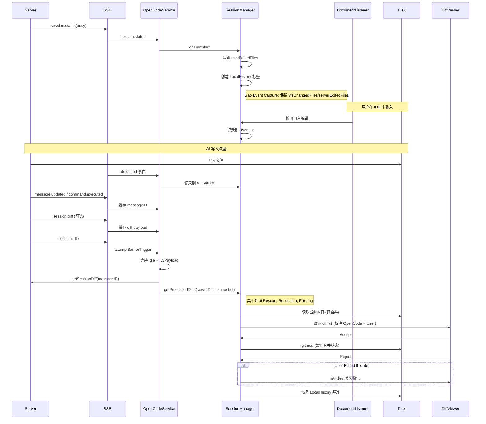

# OpenCode JetBrains 差异对比功能设计

## 概述

本文档描述了 OpenCode JetBrains 插件的 diff 工作流。设计理念与 Claude Code 一致：以工作区（Working Tree）为事实来源，依赖显式的 `file.edited` 事件和 `DocumentListener` 来归因变更，并使用 LocalHistory 进行安全回滚。

---

## 核心架构与数据流

插件优先使用 **本地 Git 操作** 而非服务器端的 revert API。这保持了插件在无状态模式下的弹性，并利用了 JetBrains 的 VCS 集成。

### Diff 流程图



---

## 关键流程

### 1. Diff 收集与展示

- **触发器**: SSE `session.status` (`busy` → `idle`) 和 `session.idle`。
- **策略: 服务器权威 + 客户端智能矫正**: 
  - **Server Authoritative**: 默认信任服务器返回的 Diff 数据。
  - **Pre-Filter (Stale Protection)**: 如果 Server 返回的 Diff 显示无变化 (`Before == After`) 但 VFS 检测到了物理修改，视为 Server 数据滞后，强制丢弃该 Diff 并触发 Rescue。
  - **Gap State Sync**: 在 `onTurnStart` 时，将 Gap 期（空闲期）的用户修改同步到内存快照，防止 AI 覆盖用户在回合间隙所做的修改。
  - **VFS Rescue**: 对 Server 漏报或滞后的文件（删除、新建、或被 Pre-Filter 丢弃的修改），利用本地快照合成 Diff。

- **Busy 开始**:
  - **Gap Sync**: 将 Gap 期的 `vfsChangedFiles` 同步到 `lastKnownFileStates`。
  - **Memory Snapshot**: 锁定当前已知状态为 `startOfTurnKnownState`。
  - 创建 LocalHistory 基准标签 `OpenCode Modified Before`。

- **Idle 阶段**:
  - **Strict Barrier**: 等待 Idle + ID/Payload。
  - **Baseline Resolution (四级回退)**:
    1. **Pre-emptive Capture (`capturedBeforeContent`)**: 最高优先级。Turn 开始前通过 VFS 事件捕获的内容。
    2. **LocalHistory**: 通过 Turn Start 时的 Label 回溯。
    3. **Known State**: 内存快照 (处理 Reject 后的状态丢失)。
    4. **Disk Fallback**: 仅当 Server 意图为删除 (`After=""`) 且 `Before=""` 时读取磁盘 (防止新建文件误判)。
  - **Content Filtering**: 过滤 `Before == After` 的文件，除非触发 **VFS Rescue**。

- **展示**: 使用 DiffManager 多文件链展示。

### 2. Accept (暂存变更)

- **操作**: `git add <file>` 或 `git add -A <file>`。
- **行为**: 暂存当前磁盘内容。

### 3. Reject (恢复变更)

- **操作**: 恢复到 `before` 状态（优先使用 LocalHistory，降级使用 Server Before）。
- **安全性**:
  - 如果文件包含用户编辑，在继续前显示警告对话框。
  - 如果判定为新建文件，执行物理删除。

---

## 策略矩阵

| 场景 | 文件状态 | OpenCode 动作 | 用户动作 | Diff 标签 | Reject 行为 |
|----------|------------|-----------------|-------------|------------|-----------------|
| **A** | 已修改 | Edited | 无 | Normal | 恢复基准 |
| **B** | 已修改 | Edited | Edited | Modified (OpenCode + User) | **警告** -> 恢复 |
| **C** | 仅 Diff | (VFS 延迟) | 无 | Normal | 恢复 Server Before |
| **D** | 新文件 | Created | Edited | Modified (OpenCode + User) | **警告** -> 删除 |

---

## 已知问题与缓解措施

- **缺少 `messageID`**: 触发 Barrier Timeout (2秒)，使用 session summary 或 SSE payload 作为回退。
- **Server 中文文件名编码**: 由 `FileDiffDeserializer` 处理。
- **LocalHistory 查找失败**: 回退顺序为 Known State (内存) → Disk Fallback (仅删除意图) → Server Before。
- **Ghost Diff**: 使用 `Before == After` 过滤，VFS Rescue 防止误过滤真实删除。
- **Late Baseline 竞态**: 通过 Gap Event Capture (VFS 事件轮转在 Turn End) 解决。

---

## 实现细节 (2026-01-24 架构终局)

### 核心架构：信号分离与抢占式捕获

我们构建了一个分层防御体系，旨在从根本上解决时序竞态和信号混淆问题。

#### 1. 信号分离与保守补救 (Signal Separation & Conservative Rescue)

SessionManager 严格区分以下信号：
*   **VFS 变更 (`vfsChangedFiles`)**: 物理层面的文件变化。
*   **Server 声明 (`serverEditedFiles`)**: AI 明确声明其修改了的文件（通过 SSE `file.edited` 事件）。
*   **用户编辑 (`userEditedFiles`)**: IDE 检测到的用户手动输入。

**Pre-Filter (智能预过滤)**:
在处理 Server Diff 之前，检查 `if (diff.before == diff.after && isVfsTouched)`。如果成立，说明 Server 返回了过时数据（Stale Diff），直接丢弃，强制进入 Rescue 流程读取磁盘最新状态。

**Conservative Rescue 策略** (2026-01-25 修复):

为了防止误报（如用户操作被误归因为 AI），Rescue 需要满足严格的 AI 亲和力条件：

**共同前提**：
*   Server API 返回的 Diff 列表中不包含该文件（或已被 Pre-Filter 丢弃）
*   文件不在 `userEditedFiles` 列表中（排除用户操作）

**删除文件 Rescue** (`!exists`):
1.  有 `capturedBeforeContent` (我们知道原始内容，可以安全恢复)
2.  或 Server 通过 `file.edited` SSE 声明过该文件 (`serverEditedFiles`)

**新建文件 Rescue** (`exists && isVfsCreated`):
*   **必须同时满足** VFS 检测到创建 (`aiCreatedFiles`) + Server SSE 声明 (`serverEditedFiles`)

**修改文件 Rescue** (`exists && !isVfsCreated`):
*   **必须满足** Server SSE 声明 (`serverEditedFiles`)。这用于修复 Server Diff 滞后导致修改丢失的问题。

此策略有效解决了：
*   Ghost Diffs（无实质变更的 Diff）
*   连续修改文件时 Diff 丢失 (通过 Pre-Filter + Rescue)
*   用户手动编辑被 AI 抢功

#### 3. 过滤策略 (Filtering Strategy)

为了平衡 Diff 的可见性与安全性，我们采用 "Server Authoritative with Affinity Check" 策略。

*   **核心原则**:
    *   **API 信任**: 我们优先获取 Server API 返回的 Diff。
    *   **亲和力校验 (Affinity Check)**: 为了防止 Server 返回上一轮的旧数据（Stale Diffs），我们要求每个文件必须在当前 Turn 有“生命迹象”。
    *   **有效信号**: SSE 声明 (`serverEditedFiles`) **或** VFS 物理变动 (`vfsChangedFiles`/`captured`/`aiCreated`)。
    *   **规则**: `if (!isServerClaimed && !isVfsTouched) -> SKIP`。

*   **强制过滤条件 (Hard Filters)**:
    1.  **用户冲突 (User Safety)**:
        *   `if (isUserEdited) -> SKIP`: 如果检测到用户在当前 Turn 内手动编辑了该文件，**绝对不显示**。这是最高优先级规则。
    2.  **无实质变更 (Ghost Diffs)**:
        *   `if (Before == After) -> SKIP`: 如果解析出的“修改前”内容与当前磁盘内容完全一致，视为无效 Diff，不予显示。

*   **Turn 隔离 (Strict Isolation)**:
    *   在 `onTurnStart` 时强制清空所有变更集合，确保上一轮的滞后信号绝不会污染当前轮次。这使得亲和力校验能够精准工作。

---

## 核心架构重构 (旧版存档)

重构后的架构遵循 "Server Authoritative" 原则：

```
┌─────────────────────────────────────────────────────────────────┐
│                       OpenCodeService                            │
│  (SSE 事件分发, Turn 生命周期触发, API 调用, Barrier 协调)       │
├─────────────────────────────────────────────────────────────────┤
│  handleEvent()                                                   │
│    ├─ session.status(busy)  → sessionManager.onTurnStart()       │
│    │                          clearTurnState()                   │
│    ├─ file.edited           → sessionManager.onFileEdited()      │
│    ├─ session.status(idle)  → sessionManager.onTurnEnd()         │
│    │   session.idle           + turnSnapshots[sId] = snapshot    │
│    │                          attemptBarrierTrigger()            │
│    ├─ message.updated       → recordTurnMessageId()              │
│    └─ session.diff          → turnPendingPayloads[sId] = diffs   │
│                                                                  │
│  Barrier Logic:                                                  │
│    - Wait for (Idle + MessageID) or (Idle + Payload)             │
│    - Timeout: 2000ms → force fetch                               │
│    - Debounce: 1500ms between triggers                           │
└─────────────────────────────────────────────────────────────────┘
                                 │
                                 ▼
┌─────────────────────────────────────────────────────────────────┐
│                       SessionManager                             │
│  (Turn 状态, Diff 处理, Baseline 解析, Accept/Reject 操作)       │
├─────────────────────────────────────────────────────────────────┤
│  Turn State:                                                     │
│    - turnNumber: Int (单调递增隔离)                              │
│    - isBusy: Boolean                                             │
│    - baselineLabel: Label (LocalHistory 基准)                    │
│    - aiEditedFiles: ConcurrentSet (VFS 检测, Gap Event Capture)  │
│    - aiCreatedFiles: ConcurrentSet (新建文件检测)                │
│    - userEditedFiles: ConcurrentSet (冲突检测)                   │
│    - lastKnownFileStates: Map (Reject 后的内存快照)              │
│                                                                  │
│  Core APIs:                                                      │
│    - onTurnStart(): Boolean (开始新 Turn)                        │
│    - onTurnEnd(): TurnSnapshot? (创建不可变快照)                 │
│    - processDiffs(serverDiffs, snapshot): List<DiffEntry>        │
│    - resolveBeforeContent(path, diff, snapshot): String          │
│    - acceptDiff(entry, callback): 异步 git add                   │
│    - rejectDiff(entry, callback): 异步恢复文件                   │
└─────────────────────────────────────────────────────────────────┘
                                 │
                                 ▼
┌─────────────────────────────────────────────────────────────────┐
│                       DiffViewerService                          │
│  (多文件 Diff 展示, 导航)                                        │
├─────────────────────────────────────────────────────────────────┤
│  showMultiFileDiff(entries, startIndex)                          │
│    → 创建 DiffChain                                              │
│    → 注册 Accept/Reject Actions                                  │
│    → 打开 IDE Diff 窗口                                          │
└─────────────────────────────────────────────────────────────────┘
```

### 简化的数据模型

**DiffEntry** (当前实现):

```kotlin
data class DiffEntry(
    val file: String,                    // 相对路径 (规范化)
    val diff: FileDiff,                  // 文件差异内容
    val hasUserEdits: Boolean = false,   // 用户是否也编辑过
    val resolvedBefore: String? = null,  // 解析后的 Before 内容 (来自 LocalHistory 或内存快照)
    val isCreatedExplicitly: Boolean = false  // VFS 是否检测到创建事件
) {
    /** 
     * 判断是否为新建文件。必须同时满足:
     * 1. VFS 检测到创建事件 (物理创建)
     * 2. Server Diff 表明之前没有内容 (逻辑创建)
     * 这防止 "Replace" 操作 (Delete+Create) 被误判为新文件。
     */
    val isNewFile: Boolean get() = isCreatedExplicitly && diff.before.isEmpty()
    
    /** 获取 Before 内容: 优先使用解析值，回退到 Server 值 */
    val beforeContent: String get() = resolvedBefore ?: diff.before
}
```

**删除的冗余字段**:
- `DiffBatch`, `DiffBatchSummary` (未使用)
- `sessionId`, `messageId`, `partId`, `timestamp` (未使用)
- `canRevert()` 方法 (逻辑内联到 reject 流程)

### Accept/Reject 异步操作设计

`acceptDiff` 和 `rejectDiff` 采用**回调模式**：

```kotlin
fun acceptDiff(entry: DiffEntry, onComplete: ((Boolean) -> Unit)? = null)
fun rejectDiff(entry: DiffEntry, onComplete: ((Boolean) -> Unit)? = null)
```

**关键设计决策**:

1. **状态延迟清除**: `pendingDiffs.remove(path)` 仅在操作成功后执行
2. **回调在 EDT 调用**: 调用方可安全更新 UI
3. **边缘情况处理**:
   - `acceptDiff`: 检查 `waitFor` 返回值和 `exitCode` 双重验证
   - `rejectDiff`: 文件不存在且 before 为空时视为成功（no-op 场景）

### Reject 用户编辑警告

根据策略矩阵，当 `entry.hasUserEdits == true` 时（场景 B/D），显示数据丢失警告：

```
WARNING: You have also edited this file. Your changes will be lost!
```

对话框标题变更为 "Confirm Reject (Data Loss Warning)" 以强调风险。

### Turn 生命周期与 Snapshot 机制

```kotlin
// 1. Turn 开始 (session.status → busy)
sessionManager.onTurnStart(): Boolean
  → turnNumber++
  → isBusy = true
  → 清空 userEditedFiles
  → 创建 LocalHistory 基准标签
  → 注意: aiEditedFiles/aiCreatedFiles 不在此清空 (Gap Event Capture)

// 2. 编辑追踪
sessionManager.onFileEdited(path)  // AI 编辑 (来自 file.edited SSE)
VFS Listener                        // 自动检测文件系统变更
documentListener                    // 用户编辑 (IDE 内自动检测)

// 3. Turn 结束 (session.idle)
sessionManager.onTurnEnd(): TurnSnapshot?
  → isBusy = false
  → 创建 TurnSnapshot (不可变快照)
  → 轮转 aiEditedFiles/aiCreatedFiles 为新集合 (Gap Event Capture)
  → 返回 Snapshot 供后续处理使用

// 4. Diff 展示 (OpenCodeService 触发)
fetchAndShowDiffs(sessionId, snapshot)
  → GET /session/:id/diff?messageID=xxx
  → forceVfsRefresh(diffs + knownFiles) // 确保物理删除也能被检测到
  → sessionManager.getProcessedDiffs(serverDiffs, snapshot, lateVfsEvents)
      → VFS Rescue (Synthetic Diffs)
      → Resolve Before Content
      → Filtering (Signal Affinity, User Safety, Content)
  → diffViewerService.showMultiFileDiff(entries)
```

**TurnSnapshot** (不可变状态快照):

```kotlin
data class TurnSnapshot(
    val turnNumber: Int,
    val aiEditedFiles: Set<String>,      // VFS 检测到的 AI 编辑
    val aiCreatedFiles: Set<String>,     // VFS 检测到的新建文件
    val userEditedFiles: Set<String>,    // IDE 检测到的用户编辑
    val baselineLabel: Label?,           // LocalHistory 基准
    val knownFileStates: Map<String, String> // Reject 后的已知状态
)
```

---

## 未来路线图

### 1. 细粒度（片段级）归因
- **现状**: 归因是文件级的。
- **目标**: 使用并排或三路 diff 来区分哪些行是由 AI 修改的，哪些是由用户修改的。
- **要求**: 可靠的 Server 端 `after` 内容或内部偏移量追踪。
