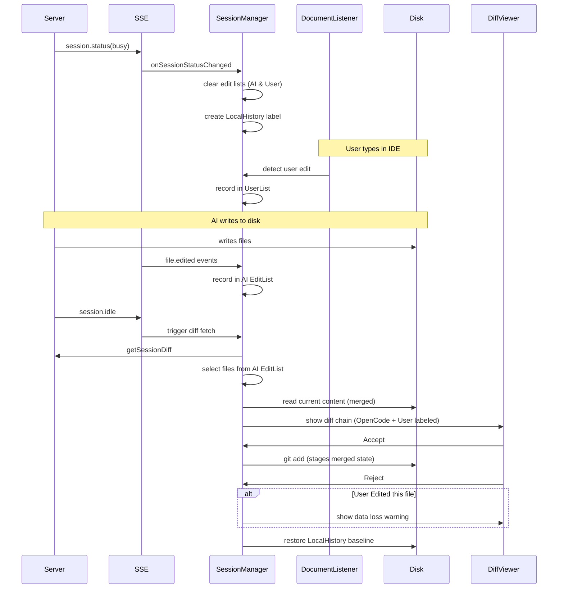

# OpenCode JetBrains Diff Feature Plan

## Overview

This document describes the diff workflow for the OpenCode JetBrains plugin. The design aligns with Claude Code: use the working tree as the source of truth, rely on explicit `file.edited` events and a `DocumentListener` to attribute changes, and use LocalHistory for safe rollback.

---

## Core Architecture & Data Flow

The plugin prioritizes **local Git operations** rather than server-side revert APIs. This keeps the plugin resilient in stateless mode and leverages JetBrains VCS integration.

### Architecture Diagram

```mermaid
graph TD
    subgraph IDE [JetBrains IDE]
        direction TB

        subgraph Services [Project Services]
            OCS[OpenCodeService]
            SM[SessionManager]
            DVS[DiffViewerService]
            DL[DocumentListener]
        end

        subgraph UI [User Interface]
            Term[Terminal Tab]
            DiffView[Diff Viewer]
        end

        subgraph Data [Local State]
            EditList[OpenCode Edited Files]
            UserList[User Edited Files]
            LocalHist[Local History Label]
            VFS[Virtual File System]
        end
    end

    subgraph Server [OpenCode Server]
        API[API Endpoints]
        SSE[SSE Stream]
    end

    Term -->|Start Process| Server
    Server -->|Events| SSE
    SSE -->|Session Status| OCS
    OCS -->|Delegate| SM

    DL -->|Track user typing| UserList
    SM -->|Create baseline label| LocalHist
    SM -->|Track file.edited events| EditList
    SM -->|Fetch diffs (fallback)| API
    API -->|Diff data| SM
    SM -->|Show diffs| DVS
    DVS -->|Render| DiffView

    DiffView -->|Accept| SM
    DiffView -->|Reject| SM

    SM -->|git add| VFS
    SM -->|Restore content| VFS
    SM -->|Create label| LocalHist
```

### Diff Flow Diagram



---

## Key Flows

### 1. Diff Collection & Display

- **Trigger**: SSE `session.status` (`busy` → `idle`) and `session.idle`.
- **Busy Start**:
  - Clear the OpenCode edit list and the User edit list.
  - Create LocalHistory label `OpenCode Modified Before`.
- **Edit Tracking**:
  - **AI Edits**: Captured via `file.edited` events (Scoping).
  - **User Edits**: Captured via `DocumentListener` (Attribution). If a change occurs within a named command (e.g., "Typing"), it is flagged as a user edit.
- **Idle Phase**:
  - Fetch session diffs from the server (metadata only).
  - Build the display list:
    - **Filter**: Only files in the OpenCode edit list are shown.
    - **Fallback**: If the AI edit list is empty, diff display is skipped and a notification is shown.
    - **UI Hints**: If a file is in both the AI and User edit lists, the right-side content title uses `Modified (OpenCode + User)`.
    - **Content**: Resolve **before** from LocalHistory baseline; resolve **after** from current disk content.
- **Display**: Use DiffManager multi-file chain.

### 2. Accept (Stage Changes)

- **Operation**: `git add <file>` or `git add -A <file>`.
- **Behavior**: Stages the current disk content (including any user micro-adjustments made during AI generation).

### 3. Reject (Restore Changes)

- **Operation**: Restore to the `before` state (LocalHistory baseline).
- **Safety**:
  - If the file contains user edits, a warning dialog is shown before proceeding.
  - After restoration, a LocalHistory label `OpenCode Rejected <file>` is created.

---

## Strategy Matrix

| Scenario | File State | OpenCode Action | User Action | Diff Label | Reject Behavior |
|----------|------------|-----------------|-------------|------------|-----------------|
| **A** | Modified | Edited | None | Normal | Restore Baseline |
| **B** | Modified | Edited | Edited | Modified (OpenCode + User) | **Warning** -> Restore |
| **C** | Modified | None | Edited | *Not shown* | N/A |
| **D** | New File | Created | Edited | Modified (OpenCode + User) | **Warning** -> Delete |

---

## Known Issues & Mitigations

- **Missing `file.edited` events**: Diff display is skipped to prevent user-only edits from being incorrectly attributed to the AI.
- **Server Chinese filename encoding**: Handled by `FileDiffDeserializer`; `after` content is read from disk, bypassing server payload bugs.
- **LocalHistory lookup failure**: Fallback order is server `before` → Git HEAD → empty string.

---

## Future Roadmap

### 1. Granular (Fragment-level) Attribution
- **Current**: Attribution is file-level.
- **Goal**: Use side-by-side or three-way diffs to distinguish which lines were modified by the AI vs. the user.
- **Requirement**: Reliable server-side `after` content or internal offset tracking.
