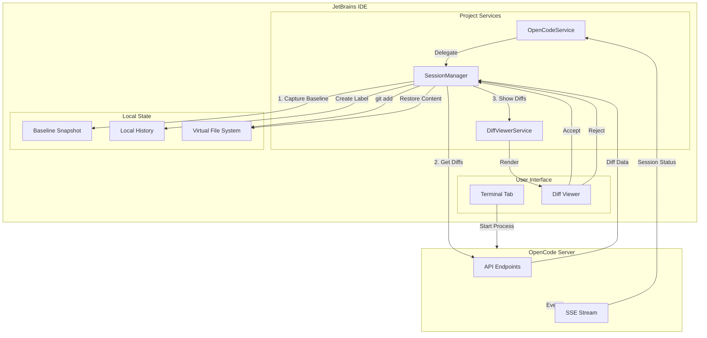
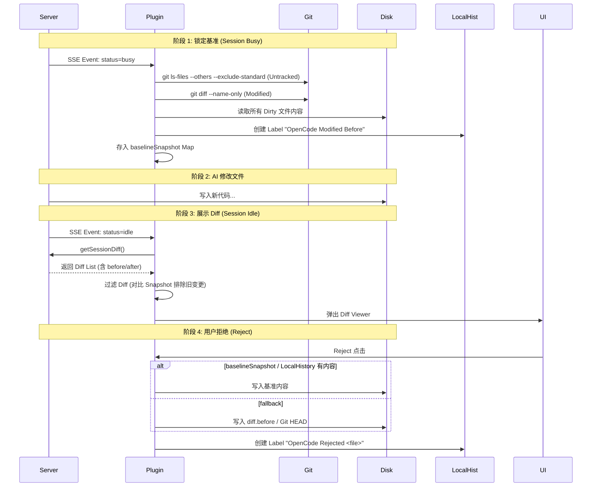

# OpenCode JetBrains 插件 Diff 功能开发计划

## 概述

本文档描述了 OpenCode JetBrains 插件的 Diff 功能实现状态。功能设计对标 Claude Code JetBrains 插件，旨在提供流畅、原生且无缝的代码审查体验。

---

## 核心架构与数据流

插件采用 **本地 Git 操作优先** 的策略来管理代码变更，而非依赖服务端的 Revert API。这种设计使得插件在无状态（Stateless）模式下运行更健壮，且能充分利用 JetBrains 的 Git 集成能力。

### 架构图



### 关键流程

#### 1. Diff 获取与展示机制
- **触发时机**: 监听 SSE `session.idle` 事件（AI 完成一轮输出）。
- **数据获取**: 调用 `client.getSessionDiff()` 拉取当前 Session 的变更。
- **展示语义**: 左侧为 AI 修改前的基准（`baselineSnapshot` / LocalHistory），右侧为 AI `after` 内容。
- **本地修改提示**: 若当前磁盘内容与 AI `after` 不一致，Diff 标题会显示 `Local Modified` 提示。
- **隐式接受 (Implicit Accept)**: 
  - 每次只展示**当前轮次**的新变更。
  - 通过比对 `processedDiffs` 和 `baselineSnapshot`，自动过滤掉上一轮已展示且内容未变的 Diff。
  - 未在当前轮次处理的旧 Diff 视为用户默认接受（保留在磁盘上）。

#### 2. Accept (接受变更)
- **操作**: 用户点击 "Accept"。
- **执行**: 若磁盘内容与 AI `after` 不一致，弹出确认提示；确认后将 **AI `after` 写入磁盘**，再执行 `git add`（删除场景用 `git add -A <file>`）。
- **效果**: 文件被暂存（Staged），从 Diff 列表中移除；`baselineSnapshot` 更新为当前磁盘内容，确保下一轮 Diff 基准正确。

#### 3. Reject (拒绝变更)
- **操作**: 用户点击 "Reject"。
- **执行**: 恢复文件内容到 **AI 修改前** 的状态。
- **数据源**: 先用 `baselineSnapshot`，若无则用 LocalHistory Label（`OpenCode Modified Before`），再回退到 `diff.before` 或 Git HEAD。
- **效果**: 文件内容回滚，从 Diff 列表中移除；`baselineSnapshot` 更新为恢复后的内容。

---

## 策略详解

### 1. Diff 处理策略矩阵

| 场景 | 文件原状态 | AI 操作 | `diff.before` | Accept 行为 | Reject 行为 |
|------|-----------|---------|---------------|-------------|-------------|
| **A** | 不存在 | 创建新文件 | `""` (空) | 写入 `after` -> `git add` | **物理删除文件** |
| **B** | Untracked (有内容) | 修改内容 | 原内容 | 写入 `after` -> `git add` | 写回 `before` / Snapshot / LocalHistory |
| **C** | Tracked (Clean) | 修改内容 | HEAD 内容 | 写入 `after` -> `git add` | 写回 `before` / Snapshot / LocalHistory |
| **D** | Tracked (Dirty) | 修改内容 | Dirty 内容 | 写入 `after` -> `git add` | 写回 `before` / Snapshot / LocalHistory |

### 2. 快照与基准机制 (Baseline Snapshot)

为了确保 Reject 操作的绝对安全，插件实现了双重保险机制，并在 Accept 时写回 AI `after`：



### 3. LocalHistory 保护细节

IntelliJ 的 LocalHistory 是最后的防线。插件在关键节点自动打标：

| 触发点 | 标签名称 | 作用 |
|--------|----------|------|
| **Session 开始** | `OpenCode Modified Before` | 记录 AI 动手前的磁盘真实状态 |
| **Session 结束** | `OpenCode Modified After` | 记录 AI 完成后的完整状态 |
| **执行 Reject** | `OpenCode Rejected <file>` | 记录被用户拒绝掉的内容（防止误拒绝后悔） |

---

## 目录结构

```
src/main/kotlin/ai/opencode/ide/jetbrains/
├── diff/
│   ├── DiffViewerService.kt        # Diff 展示与生命周期管理
│   ├── OpenCodeDiffEditorActions.kt # Accept/Reject 动作定义
│   └── DiffEntry.kt                # Diff 数据实体
├── session/
│   └── SessionManager.kt           # 核心逻辑：快照捕获、Diff 过滤、Git 操作
└── api/
    └── models/
        └── FileDiff.kt             # 数据模型 (含中文文件名解码逻辑)
```

## 已知问题与规避方案

### 服务端中文文件名 Bug
**现象**: Go 服务端返回的 JSON 中，中文文件名被 `%q` 转义（如 `"\344\270..."`），导致 `before`/`after` 内容为空。
**规避**:
1. **文件名解码**: 插件通过 `FileDiffDeserializer` 自动识别并还原八进制转义序列。
2. **内容回退**: 当 `diff.after` 为空但 `additions > 0` 时，插件自动从磁盘读取当前文件内容作为 `after` 展示。
3. **基准回退**: Reject 时若 `diff.before` 为空，自动使用 `baselineSnapshot` / LocalHistory 恢复。
