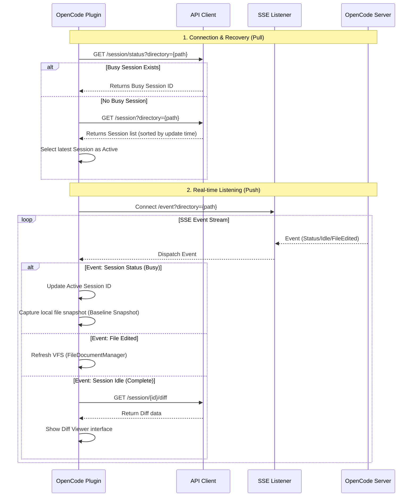

# base_feature.plan.md - OpenCode JetBrains Plugin

**Author**: hhlai1990@gmail.com

## Overview

This is a JetBrains IDE plugin that integrates [OpenCode](https://opencode.ai) (an open-source AI coding agent) into the IDE workflow.

This document describes the user experience and implementation details of the "base features," aligned with the interaction patterns of the Claude Code JetBrains plugin.

## Implemented Features

### 1) Quick Launch (Open/Focus Terminal)

| Platform | Shortcut |
|----------|----------|
| Mac | `Cmd + Esc` |
| Windows/Linux | `Ctrl + \` |

**Behavior:**
- Shows a connection dialog allowing the user to enter a custom `host:port` and optional password (default `127.0.0.1:4096`).
  - **WSL Note**: If the OpenCode server runs in WSL, `127.0.0.1` is not directly reachable — user must enter the WSL actual IP.
  - **IPv6 Note**: Avoid using `localhost`; some Windows environments resolve it to IPv6, causing connection failures. Recommend forcing `127.0.0.1`.
- **Persistent Memory**: Auto-saves the last connected address and password (stored using simple Base64 encoding).
- **Connect to Existing Server**: Detect and connect to OpenCode Desktop or another already-running OpenCode server. Supports automatic HTTP Basic Authentication, manual password entry, and passing credentials via environment variables to the CLI.
  - **Process Info Reading Compatibility**: Windows may depend on PowerShell/WMI; Linux reading `/proc/{pid}/environ` may be restricted by permissions. On failure, must fall back to manual password entry.
- **Create New Terminal**: If hostname is localhost and the port is the default, creates an `OpenCode({port})` terminal tab in the **Editor area** and starts the local server (more space, better for TUI display).
- The IDE does NOT auto-create a terminal on startup; only explicit user action triggers launch.

### 2) Add Context to Terminal

| Platform | Shortcut |
|----------|----------|
| Mac | `Opt + Cmd + K` |
| Windows/Linux | `Ctrl + Alt + K` |

**Behavior:**
- **Editor (with selection)**: Sends `@path#Lstart-end` (reference only, no source content sent).
- **Editor (no selection)**: Sends `@path` (current file reference).
- **Project View (multi-select files/directories)**: Sends `@path` for each entry.
- **Path Format Convention**: `@path` uniformly uses project-relative paths with forward slashes `/`, avoiding Windows `\` parsing failures.
- If the OpenCode terminal is not open: the plugin auto-creates/focuses the terminal, then inserts the reference (avoids the "no terminal, no response" confusion).

### 3) Sidebar Icon (Right Toolbar)

- Right toolbar displays a single OpenCode icon.
- Clicking the icon triggers Quick Launch behavior (focus/create terminal).
- The ToolWindow itself shows no complex content: it hides immediately after triggering (aligned with Claude's "click to jump" style).

## Technical Implementation

### Architecture (Core Objects)

```
OpenCodeService (Project-scoped)
├── focusOrCreateTerminal()            # Shows connection dialog, connects or creates terminal
├── connectToExistingServer()          # Connect to an existing OpenCode server (supports auto-auth)
├── createTerminalAndConnect()         # Create terminal tab in Editor area and start server
├── pasteToTerminal()                  # Paste to existing terminal
└── focusOrCreateTerminalAndPaste()    # Unified UX: auto-creates and retries paste

OpenCodeTerminalVirtualFile            # Virtual file representing a terminal tab in Editor
OpenCodeTerminalFileEditor             # FileEditor implementation, wraps terminal widget
OpenCodeTerminalFileEditorProvider     # FileEditorProvider, manages terminal editor creation

OpenCodeConnectDialog                  # Connection dialog (input host:port + optional password)
ProcessAuthDetector                    # Auto-detect OpenCode Desktop authentication info
OpenCodeApiClient                      # HTTP API client (supports Basic Auth)
SseEventListener                       # SSE event listener (supports Basic Auth)
PortFinder                             # Port detection and health check (supports Basic Auth)

OpenCodeToolWindowFactory              # Right toolbar icon behavior
QuickLaunchAction                      # Cmd+Esc / Ctrl+\ handler
SendSelectionToTerminalAction          # Opt+Cmd+K handler
```

### Session & API Client Listening Mechanism

**Core Mechanism: Active Pull (Recovery) + Real-time Push (SSE)**

Listeners are bound to the **project path**, not a single Session. This means any operations on the same project from the same Server are detectable by the IDE, which auto-switches focus.



**Key Strategies:**

1. **Project-Level Locking**: Listening is based on physical path, covering all concurrent Sessions under that path.
2. **Active Preemption**: Any Session transitioning to `busy` status becomes the `activeSessionId`, ensuring the Diff Viewer always shows the currently-working AI context.
3. **Baseline Snapshot**: Captures local file state at the `busy` moment as the "source of truth" for Reject operations, solving the problem of potentially inaccurate server-side `before` content.

### Key APIs

- `TerminalView.createLocalShellWidget()` - Create Terminal widget
- `ShellTerminalWidget.executeCommand()` - Execute command
- `TtyConnector.write()` - Inject text into terminal
- `FileEditorManager` - Manage Editor area files/tabs
- `FileEditorProvider` - Custom Editor types (for terminal tabs)
- `FileEditorManagerListener` - Listen for Editor tab close events
- `Alarm` - Debounce/scheduling (avoids custom thread pools)

### plugin.xml (Key Registration Points)

- Actions:
  - `OpenCode.QuickLaunch` (Tools menu + shortcut)
  - `OpenCode.AddLines` (EditorPopupMenu)
  - `OpenCode.AddFile` (ProjectViewPopupMenu)
- Extensions:
  - `toolWindow` id=`OpenCode`
  - `projectService`: `OpenCodeService` / `SessionManager` / `DiffViewerService`

## Project Structure (Key Paths)

```
src/main/kotlin/ai/opencode/ide/jetbrains/
├── OpenCodeService.kt
├── OpenCodeToolWindow.kt
├── QuickLaunchAction.kt
├── SendSelectionToTerminalAction.kt
├── diff/
├── session/
├── terminal/
├── util/

src/main/resources/META-INF/plugin.xml
```

## Test Cases

1. Press `Cmd+Esc` / `Ctrl+\`: Create or focus `OpenCode({port})` terminal tab in Editor area.
2. Editor no selection, press `Opt+Cmd+K`: Insert `@current-file`.
3. Editor with selection, press `Opt+Cmd+K`: Insert `@current-file#Lx-y`.
4. Project View multi-select files/directories, press `Opt+Cmd+K`: Insert multiple `@path`.
5. Click OpenCode icon in right toolbar: Focus/create terminal in Editor area.
6. Close OpenCode terminal tab: Auto-cleanup connection state.
