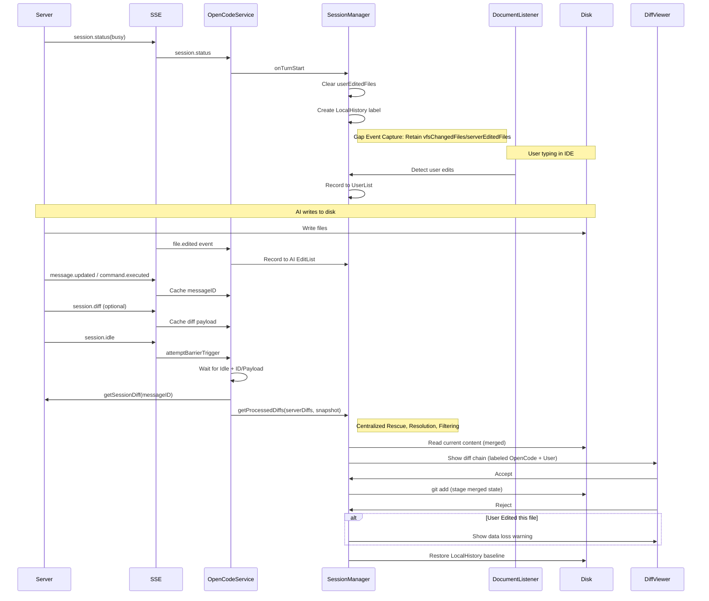

# OpenCode JetBrains Diff Feature Design

## Overview

This document describes the diff workflow for the OpenCode JetBrains plugin. The design philosophy aligns with Claude Code: the Working Tree is the source of truth, explicit `file.edited` events and `DocumentListener` are used for change attribution, and LocalHistory is used for safe rollback.

---

## Core Architecture & Data Flow

The plugin prioritizes **local Git operations** over server-side revert APIs. This keeps the plugin resilient in stateless mode and leverages JetBrains' VCS integration.

### Diff Flow



---

## Key Workflows

### 1. Diff Collection & Display

- **Triggers**: SSE `session.status` (`busy` → `idle`) and `session.idle`.
- **Strategy: Server Authoritative + Client-side Smart Correction**: 
  - **Server Authoritative**: Default trust in server-returned Diff data.
  - **Pre-Filter (Stale Protection)**: If the server Diff shows no change (`Before == After`) but VFS detected physical modification, treat server data as stale, forcefully discard the Diff and trigger Rescue.
  - **Gap State Sync**: At `onTurnStart`, sync Gap-period (idle period) user modifications to in-memory snapshots, preventing AI from overwriting user modifications made between turns.
  - **VFS Rescue**: For files missed or stale from the server (deleted, created, or modifications discarded by Pre-Filter), synthesize Diffs using local snapshots.

- **Busy Start**:
  - **Gap Sync**: Sync Gap-period `vfsChangedFiles` to `lastKnownFileStates`.
  - **Memory Snapshot**: Lock current known state as `startOfTurnKnownState`.
  - Create LocalHistory baseline label `OpenCode Modified Before`.

- **Idle Phase**:
  - **Strict Barrier**: Wait for Idle + ID/Payload.
  - **Baseline Resolution (4-level fallback)**:
    1. **Pre-emptive Capture (`capturedBeforeContent`)**: Highest priority. Content captured via VFS events before turn start.
    2. **LocalHistory**: Trace back through the Turn Start Label.
    3. **Known State**: In-memory snapshot (handles state loss after Reject).
    4. **Disk Fallback**: Only read disk when Server intent is deletion (`After=""`) and `Before=""` (prevents new-file false positives).
  - **Content Filtering**: Filter out `Before == After` files unless **VFS Rescue** triggers.

- **Display**: Uses DiffManager multi-file chain display.

### 2. Accept (Stage Changes)

- **Operation**: `git add <file>` or `git add -A <file>`.
- **Behavior**: Stages current disk content.

### 3. Reject (Restore Changes)

- **Operation**: Restore to `before` state (prefer LocalHistory, fallback to Server Before).
- **Safety**:
  - If file contains user edits, show warning dialog before proceeding.
  - If determined to be a newly-created file, perform physical deletion.

---

## Strategy Matrix

| Scenario | File State | OpenCode Action | User Action | Diff Label | Reject Behavior |
|----------|------------|-----------------|-------------|------------|-----------------|
| **A** | Modified | Edited | None | Normal | Restore baseline |
| **B** | Modified | Edited | Edited | Modified (OpenCode + User) | **Warn** -> Restore |
| **C** | Diff Only | (VFS delayed) | None | Normal | Restore Server Before |
| **D** | New File | Created | Edited | Modified (OpenCode + User) | **Warn** -> Delete |

---

## Known Issues & Mitigations

- **Missing `messageID`**: Triggers Barrier Timeout (2 seconds), uses session summary or SSE payload as fallback.
- **Server Chinese Filename Encoding**: Handled by `FileDiffDeserializer`.
- **LocalHistory Lookup Failure**: Fallback order is Known State (memory) → Disk Fallback (delete intent only) → Server Before.
- **Ghost Diff**: Uses `Before == After` filter, VFS Rescue prevents filtering genuine deletions.
- **Late Baseline Race Condition**: Resolved via Gap Event Capture (VFS event rotation at Turn End).

---

## Implementation Details (2026-01-24 Architecture Final)

### Core Architecture: Signal Separation & Pre-emptive Capture

We built a layered defense system to fundamentally solve timing races and signal confusion.

#### 1. Signal Separation & Conservative Rescue

SessionManager strictly distinguishes these signals:
* **VFS Changes (`vfsChangedFiles`)**: Physical file changes.
* **Server Claims (`serverEditedFiles`)**: Files the AI explicitly declared it modified (via SSE `file.edited` events).
* **User Edits (`userEditedFiles`)**: Manual user input detected by the IDE.

**Pre-Filter (Smart Pre-Filtering)**:
Before processing Server Diffs, check `if (diff.before == diff.after && isVfsTouched)`. If true, the Server returned stale data — directly discard and force Rescue to read latest disk state.

**Conservative Rescue Strategy** (2026-01-25 Fix):

To prevent false positives (e.g., user actions misattributed to AI), Rescue requires strict AI affinity conditions:

**Common Prerequisites**:
* Server API Diff list does NOT contain this file (or it was discarded by Pre-Filter)
* File is NOT in `userEditedFiles` list (excludes user actions)

**Deleted File Rescue** (`!exists`):
1. Has `capturedBeforeContent` (we know the original content, can safely restore)
2. Or Server declared this file via `file.edited` SSE (`serverEditedFiles`)

**New File Rescue** (`exists && isVfsCreated`):
* **Must satisfy both** VFS detection of creation (`aiCreatedFiles`) + Server SSE declaration (`serverEditedFiles`)

**Modified File Rescue** (`exists && !isVfsCreated`):
* **Must satisfy** Server SSE declaration (`serverEditedFiles`). Used to fix modification loss caused by server Diff lag.

This strategy effectively resolves:
* Ghost Diffs (Diffs with no substantive changes)
* Diff loss during continuous file modifications (via Pre-Filter + Rescue)
* User manual edits being claimed by AI

#### 3. Filtering Strategy

To balance Diff visibility and safety, we use a "Server Authoritative with Affinity Check" strategy.

* **Core Principles**:
  * **API Trust**: Prioritize Server API returned Diffs.
  * **Affinity Check**: To prevent the Server from returning stale Diffs from previous turns, require each file to have "signs of life" in the current Turn.
  * **Valid Signals**: SSE claims (`serverEditedFiles`) **or** VFS physical changes (`vfsChangedFiles`/`captured`/`aiCreated`).
  * **Rule**: `if (!isServerClaimed && !isVfsTouched) -> SKIP`.

* **Hard Filters**:
  1. **User Conflict (User Safety)**:
     * `if (isUserEdited) -> SKIP`: If the user manually edited this file during the current Turn, **absolutely do not show**. This is the highest-priority rule.
  2. **No Substantive Change (Ghost Diffs)**:
     * `if (Before == After) -> SKIP`: If the resolved "before" content is identical to the current disk content, treat as invalid Diff, do not display.

* **Turn Isolation (Strict Isolation)**:
  * Force-clear all change collections at `onTurnStart`, ensuring stale signals from previous turns never pollute the current one. This makes affinity checks precise.

---

## Core Architecture Refactor (Old Archive)

The refactored architecture follows the "Server Authoritative" principle:

```
┌─────────────────────────────────────────────────────────────────┐
│                       OpenCodeService                            │
│  (SSE event dispatch, Turn lifecycle triggers, API calls,        │
│   Barrier coordination)                                          │
├─────────────────────────────────────────────────────────────────┤
│  handleEvent()                                                   │
│    ├─ session.status(busy)  → sessionManager.onTurnStart()       │
│    │                          clearTurnState()                   │
│    ├─ file.edited           → sessionManager.onFileEdited()      │
│    ├─ session.status(idle)  → sessionManager.onTurnEnd()         │
│    │   session.idle           + turnSnapshots[sId] = snapshot    │
│    │                          attemptBarrierTrigger()            │
│    ├─ message.updated       → recordTurnMessageId()              │
│    └─ session.diff          → turnPendingPayloads[sId] = diffs   │
│                                                                  │
│  Barrier Logic:                                                  │
│    - Wait for (Idle + MessageID) or (Idle + Payload)             │
│    - Timeout: 2000ms → force fetch                               │
│    - Debounce: 1500ms between triggers                           │
└─────────────────────────────────────────────────────────────────┘
                                 │
                                 ▼
┌─────────────────────────────────────────────────────────────────┐
│                       SessionManager                             │
│  (Turn state, Diff processing, Baseline resolution,              │
│   Accept/Reject operations)                                      │
├─────────────────────────────────────────────────────────────────┤
│  Turn State:                                                     │
│    - turnNumber: Int (monotonic increasing isolation)            │
│    - isBusy: Boolean                                             │
│    - baselineLabel: Label (LocalHistory baseline)                │
│    - aiEditedFiles: ConcurrentSet (VFS detection, Gap Event      │
│      Capture)                                                    │
│    - aiCreatedFiles: ConcurrentSet (new file detection)          │
│    - userEditedFiles: ConcurrentSet (conflict detection)         │
│    - lastKnownFileStates: Map (in-memory snapshot after Reject)  │
│                                                                  │
│  Core APIs:                                                      │
│    - onTurnStart(): Boolean (begin new Turn)                     │
│    - onTurnEnd(): TurnSnapshot? (create immutable snapshot)      │
│    - processDiffs(serverDiffs, snapshot): List<DiffEntry>        │
│    - resolveBeforeContent(path, diff, snapshot): String          │
│    - acceptDiff(entry, callback): async git add                  │
│    - rejectDiff(entry, callback): async file restore             │
└─────────────────────────────────────────────────────────────────┘
                                 │
                                 ▼
┌─────────────────────────────────────────────────────────────────┐
│                       DiffViewerService                          │
│  (Multi-file Diff display, navigation)                           │
├─────────────────────────────────────────────────────────────────┤
│  showMultiFileDiff(entries, startIndex)                          │
│    → Create DiffChain                                            │
│    → Register Accept/Reject Actions                              │
│    → Open IDE Diff Window                                        │
└─────────────────────────────────────────────────────────────────┘
```

### Simplified Data Model

**DiffEntry** (current implementation):

```kotlin
data class DiffEntry(
    val file: String,                    // Relative path (normalized)
    val diff: FileDiff,                  // File diff content
    val hasUserEdits: Boolean = false,   // Whether user also edited
    val resolvedBefore: String? = null,  // Resolved Before content (from LocalHistory or memory snapshot)
    val isCreatedExplicitly: Boolean = false  // Whether VFS detected creation event
) {
    /** 
     * Determine if this is a newly-created file. Must satisfy both:
     * 1. VFS detected creation event (physical creation)
     * 2. Server Diff shows no prior content (logical creation)
     * This prevents "Replace" operations (Delete+Create) from being
     * misidentified as new files.
     */
    val isNewFile: Boolean get() = isCreatedExplicitly && diff.before.isEmpty()
    
    /** Get Before content: prefer resolved value, fallback to Server value */
    val beforeContent: String get() = resolvedBefore ?: diff.before
}
```

**Removed Redundant Fields**:
- `DiffBatch`, `DiffBatchSummary` (unused)
- `sessionId`, `messageId`, `partId`, `timestamp` (unused)
- `canRevert()` method (logic inlined into reject flow)

### Accept/Reject Async Operation Design

`acceptDiff` and `rejectDiff` use a **callback pattern**:

```kotlin
fun acceptDiff(entry: DiffEntry, onComplete: ((Boolean) -> Unit)? = null)
fun rejectDiff(entry: DiffEntry, onComplete: ((Boolean) -> Unit)? = null)
```

**Key Design Decisions**:

1. **Deferred State Cleanup**: `pendingDiffs.remove(path)` only executes after successful operation.
2. **Callbacks Invoked on EDT**: Callers can safely update UI.
3. **Edge Case Handling**:
   - `acceptDiff`: Double-verify with `waitFor` return value and `exitCode`.
   - `rejectDiff`: File not found and before is empty → treat as success (no-op scenario).

### Reject User Edit Warning

Per the strategy matrix, when `entry.hasUserEdits == true` (scenarios B/D), show a data loss warning:

```
WARNING: You have also edited this file. Your changes will be lost!
```

Dialog title changes to "Confirm Reject (Data Loss Warning)" to emphasize risk.

### Turn Lifecycle & Snapshot Mechanism

```kotlin
// 1. Turn Start (session.status → busy)
sessionManager.onTurnStart(): Boolean
  → turnNumber++
  → isBusy = true
  → Clear userEditedFiles
  → Create LocalHistory baseline label
  → NOTE: aiEditedFiles/aiCreatedFiles NOT cleared here (Gap Event Capture)

// 2. Edit Tracking
sessionManager.onFileEdited(path)  // AI edit (from file.edited SSE)
VFS Listener                        // Auto-detect filesystem changes
documentListener                    // User edits (auto-detected in IDE)

// 3. Turn End (session.idle)
sessionManager.onTurnEnd(): TurnSnapshot?
  → isBusy = false
  → Create TurnSnapshot (immutable snapshot)
  → Rotate aiEditedFiles/aiCreatedFiles to new collections (Gap Event Capture)
  → Return Snapshot for subsequent processing

// 4. Diff Display (triggered by OpenCodeService)
fetchAndShowDiffs(sessionId, snapshot)
  → GET /session/:id/diff?messageID=xxx
  → forceVfsRefresh(diffs + knownFiles) // Ensure physical deletions are detected
  → sessionManager.getProcessedDiffs(serverDiffs, snapshot, lateVfsEvents)
      → VFS Rescue (Synthetic Diffs)
      → Resolve Before Content
      → Filtering (Signal Affinity, User Safety, Content)
  → diffViewerService.showMultiFileDiff(entries)
```

**TurnSnapshot** (immutable state snapshot):

```kotlin
data class TurnSnapshot(
    val turnNumber: Int,
    val aiEditedFiles: Set<String>,      // AI edits detected by VFS
    val aiCreatedFiles: Set<String>,     // New files detected by VFS
    val userEditedFiles: Set<String>,    // User edits detected by IDE
    val baselineLabel: Label?,           // LocalHistory baseline
    val knownFileStates: Map<String, String> // Known state after Reject
)
```

---

## Future Roadmap

### 1. Fine-Grained (Hunk-Level) Attribution
- **Current**: Attribution is file-level.
- **Goal**: Use side-by-side or three-way diff to distinguish which lines were modified by AI vs. user.
- **Requirements**: Reliable server-side `after` content or internal offset tracking.
