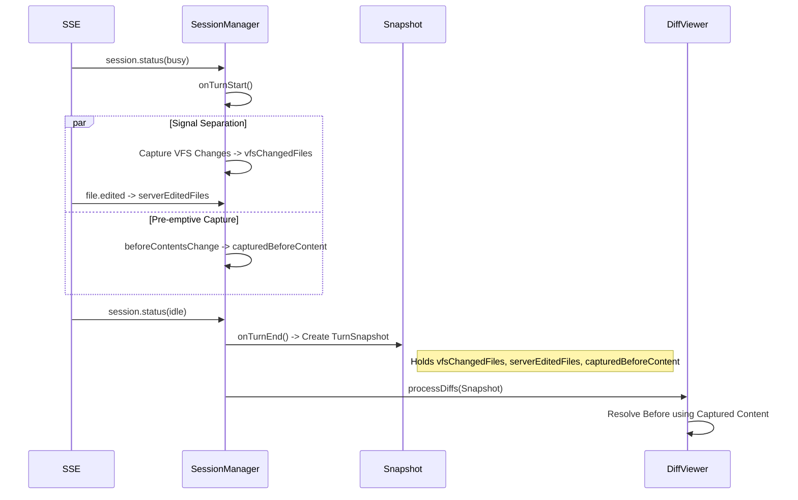

# OpenCode Plugin Testing Strategy

This document comprehensively describes the OpenCode JetBrains plugin's testing strategy, including the automated test architecture, core business logic analysis, and manual regression test cases.

---

## Part 1: Automated Testing

We use a three-layer test architecture to ensure functional correctness and stability, especially focused on Diff feature Turn isolation and race conditions.

### Test Architecture

```
Layer 3: Real IDE + Real OpenCode Server (RealProcessIntegrationTest)
Layer 1: Mock IDE + Fake Server (OpenCodeLogicTest)
```

### 1. Logic Unit Tests (`OpenCodeLogicTest`)

**Location**: `src/test/kotlin/ai/opencode/ide/jetbrains/integration/OpenCodeLogicTest.kt`

**Purpose**: Verify core business logic in a controlled environment, especially complex concurrency and state management scenarios.

**Key Components**:
- **Mock IDE**: Uses Java Proxy to mock `Project` and IntelliJ platform components.
- **Fake Server**: A lightweight Java HTTP Server simulating the OpenCode backend API and SSE event stream.

**Covered Scenarios (Turn Scenarios)**:

| Scenario | Description | Logic Verified |
| :--- | :--- | :--- |
| **Scenario A: Normal Turn** | Standard Busy -> File Edited -> Idle flow | Verify basic modification Diffs display correctly. |
| **Scenario C: Turn Isolation** | Turn 1 ends, Turn 2 starts immediately | Verify Turn 1 Diffs do NOT pollute Turn 2 (Gap Event Filtering). |
| **Scenario F: New File Safety** | AI creates a new file | Verify new file's Before is correctly resolved as empty, not reading new content from disk which would hide the Diff. |
| **Scenario G: User Edit Safety** | User modifies file + VFS Change | Verify that if a user modifies a file while AI is working, the AI Diff for that file is strictly filtered (User Priority). |
| **Scenario L: Rescue Deletion** | Server omission + physical deletion | Verify when a file physically disappears and the Server omits it, the system auto-remedies using captured original content (Captured/KnownState) and displays the Diff. |
| **Scenario N: Server Authoritative** | No VFS signal + Server Diff | Verify that as long as there is an SSE declaration, even if VFS doesn't capture it (e.g., remote modification), the Server Diff displays. |
| **Scenario O: Create then Modify** | Consecutive turns: create then modify | Verify Pre-Filter and Rescue mechanisms correctly handle server returning stale data (prevent filtering genuine modifications due to Before==After). |

### 2. Real Integration Tests (`RealProcessIntegrationTest`)

**Location**: `src/test/kotlin/ai/opencode/ide/jetbrains/integration/RealProcessIntegrationTest.kt`

**Purpose**: Verify plugin code compatibility with a **real OpenCode binary**.

**Verification Points**:
- **Connection**: Auto-detect and launch `opencode serve`, establish real SSE/HTTP connections.
- **Accept**: Simulate clicking "Accept" after AI modifies a file, verify the file is correctly `git add`-ed to staging.
- **Reject**: Simulate clicking "Reject" after AI modifies a file, verify the file content is correctly restored.
- **File Operations**: Cover edge cases like Delete, Create, Modify Empty File.

### 3. How to Run Tests

```bash
# Run all tests
./gradlew test

# Run specific test
./gradlew test --tests "ai.opencode.ide.jetbrains.integration.OpenCodeLogicTest"
```

---

## Part 2: Turn Scenario Analysis

This section details the internal logic flow of Turn isolation.

### Core Data Flow (2026-01-24 Update)



### Key Mechanisms

1. **TurnSnapshot**: Creates an immutable snapshot at Turn end. Subsequent Diff fetching and processing depends entirely on this snapshot.
2. **Signal Separation**: Strictly distinguishes VFS physical changes from Server logical declarations, only rescuing intersections to prevent misattributing user actions.
3. **Pre-emptive Capture**: Pre-emptively captures pre-change content using VFS events, solving timing race conditions.
4. **Safe Rescue**: Applies strict Ghost Diff defense to rescue logic (prevents fabricating modifications out of thin air).

---

## Part 3: Manual Test Cases

### Environment Setup
1. Run plugin: `./gradlew runIde`
2. Start OpenCode CLI.

### TC-01: Basic Diff Display
**Steps**: Have AI modify a file.
**Expected**: Diff window pops up, showing changes.

### TC-02: Delete File
**Steps**: Have AI delete a file.
**Expected**: Diff window pops up, showing file deletion. Clicking Reject should restore the file.

### TC-03: New File
**Steps**: Have AI create a new file.
**Expected**: Diff window pops up. Clicking Reject should physically delete the file.

### TC-04: Modify Empty File
**Steps**: Create an empty file `empty.txt`, have AI modify it.
**Expected**: Diff window pops up. Clicking Reject should clear the file content (does NOT delete the file).

### TC-05: Replace File
**Steps**: Have AI delete a file and create a new one with the same name.
**Expected**: Reject should restore the old file content.

### TC-06: Rapid Consecutive Conversations
**Steps**: Send a message to modify file A, immediately send another message to modify file B before the Diff pops up.
**Expected**: Ultimately should display Diffs for both A and B (or merged display), with no loss.

---

## Maintenance Guide

- **Modifying SessionManager**: Must run `OpenCodeLogicTest`.
- **Upgrading OpenCode**: Must run `RealProcessIntegrationTest`.
