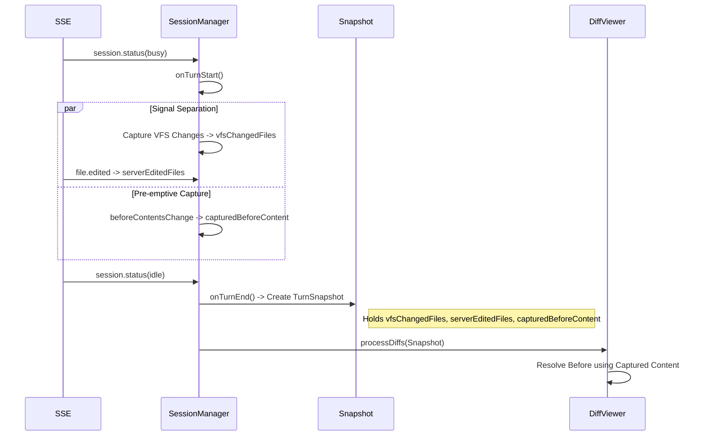

# OpenCode Plugin Testing Strategy

本文档全面描述了 OpenCode JetBrains 插件的测试策略，包括自动化测试架构、核心业务逻辑分析以及手动回归测试用例。

---

## Part 1: 自动化测试 (Automated Testing)

我们采用了三层测试架构来确保功能的正确性和稳定性，特别是针对 Diff 功能的 Turn 隔离和竞态条件。

### 测试架构

```
Layer 3: Real IDE + Real OpenCode Server (RealProcessIntegrationTest)
Layer 1: Mock IDE + Fake Server (OpenCodeLogicTest)
```

### 1. 逻辑单元测试 (`OpenCodeLogicTest`)

**位置**: `src/test/kotlin/ai/opencode/ide/jetbrains/integration/OpenCodeLogicTest.kt`

**目的**: 在受控环境中验证核心业务逻辑，特别是复杂的并发和状态管理场景。

**关键组件**:
- **Mock IDE**: 使用 Java Proxy 模拟 `Project` 和 IntelliJ 平台组件。
- **Fake Server**: 一个轻量级 Java HTTP Server，模拟 OpenCode 后端 API 和 SSE 事件流。

**覆盖场景 (Turn Scenarios)**:

| 场景 | 描述 | 验证逻辑 |
| :--- | :--- | :--- |
| **Scenario A: Normal Turn** | 标准的 Busy -> File Edited -> Idle 流程 | 验证基础修改 Diff 能正确显示。 |
| **Scenario C: Turn Isolation** | Turn 1 结束，Turn 2 立即开始 | 验证 Turn 1 的 Diff 不会污染 Turn 2（Gap Event Filtering）。 |
| **Scenario F: New File Safety** | AI 新建文件 | 验证新建文件的 Before 被正确解析为空，而不是从磁盘读取新内容导致 Diff 消失。 |
| **Scenario G: User Edit Safety** | 用户修改文件 + VFS Change | 验证如果用户在 AI 工作期间修改了文件，该文件的 AI Diff 会被严格过滤（User Priority）。 |
| **Scenario L: Rescue Deletion** | Server 漏报 + 物理删除 | 验证当文件物理消失且 Server 漏报时，系统能利用捕获的原始内容（Captured/KnownState）自动补救并显示 Diff。 |
| **Scenario N: Server Authoritative** | 无 VFS 信号 + Server Diff | 验证只要有 SSE 声明，即使 VFS 没捕获到（如远程修改），Server Diff 也能显示。 |

### 2. 真实集成测试 (`RealProcessIntegrationTest`)

**位置**: `src/test/kotlin/ai/opencode/ide/jetbrains/integration/RealProcessIntegrationTest.kt`

**目的**: 验证插件代码与**真实 OpenCode 二进制文件**的兼容性。

**验证点**:
- **连接**: 自动探测并启动 `opencode serve`，建立真实的 SSE/HTTP 连接。
- **Accept**: 模拟 AI 修改文件后点击 "Accept"，验证文件被正确 `git add` 到暂存区。
- **Reject**: 模拟 AI 修改文件后点击 "Reject"，验证文件内容被正确恢复。
- **文件操作**: 覆盖 Delete, Create, Modify Empty File 等边缘情况。

### 3. 如何运行测试

```bash
# 运行所有测试
./gradlew test

# 运行特定测试
./gradlew test --tests "ai.opencode.ide.jetbrains.integration.OpenCodeLogicTest"
```

---

## Part 2: Turn 场景分析 (Scenario Analysis)

本节详细分析 Turn 隔离的内部逻辑流。

### 核心数据流 (2026-01-24 Update)



### 关键机制

1.  **TurnSnapshot**: 在 Turn 结束时创建不可变快照，后续的 Diff 拉取和处理完全依赖此快照。
2.  **Signal Separation**: 严格区分 VFS 物理变更和 Server 逻辑声明，仅对交集进行 Rescue，防止误判用户操作。
3.  **Pre-emptive Capture**: 利用 VFS 事件抢占式捕获变更前的内容，解决时序竞态问题。
4.  **Safe Rescue**: 对 Rescue 逻辑实施严格的 Ghost Diff 防御（禁止凭空捏造修改）。

---

## Part 3: 手动测试用例 (Manual Test Cases)

### 环境准备
1. 运行插件: `./gradlew runIde`
2. 启动 OpenCode CLI。

### TC-01: 基本 Diff 展示
**步骤**: 让 AI 修改一个文件。
**预期**: Diff 窗口弹出，显示变更。

### TC-02: 删除文件
**步骤**: 让 AI 删除一个文件。
**预期**: Diff 窗口弹出，显示文件被删除。点击 Reject 应恢复文件。

### TC-03: 新建文件
**步骤**: 让 AI 新建一个文件。
**预期**: Diff 窗口弹出。点击 Reject 应物理删除该文件。

### TC-04: 修改空文件
**步骤**: 创建一个空文件 `empty.txt`，让 AI 修改它。
**预期**: Diff 窗口弹出。点击 Reject 应清空文件内容（**不删除文件**）。

### TC-05: 替换文件
**步骤**: 让 AI 删除一个文件并新建同名文件。
**预期**: Reject 应恢复旧文件内容。

### TC-06: 快速连续对话
**步骤**: 发送消息修改文件 A，在 Diff 弹出前立即发送消息修改文件 B。
**预期**: 最终应分别显示 A 和 B 的 Diff（或合并显示），不应丢失。

---

## 维护指南

- **修改 SessionManager**: 必须运行 `OpenCodeLogicTest`。
- **升级 OpenCode**: 必须运行 `RealProcessIntegrationTest`。
